<p align="center">
  
</p>

# Skip – Signal K Multi-Function Display (MFD) and Marine Instrument Panel

> **Skip** is a [HaLOS](https://halos.fi) fork of [Kip](https://github.com/mxtommy/Kip) by Thomas St.Pierre and David Godin. It adds standard Signal K session/SSO authentication and account-independent named profiles, and diverges from upstream as it evolves. The webapp is served at `/@halos-org/skip/`. Licensed under MIT (see [LICENSE](LICENSE)).

---

[](src/assets/help-docs/welcome.md)
[](src/assets/help-docs/community.md)
[](src/assets/help-docs/contact-us.md)

**Skip is a Signal K MFD and marine instrument panel: touch-optimized and ready-to-use across all your devices.**

Skip offers full MFD functionality as a Signal K webapp. Install it from the Signal K app store, then open Skip in a browser and it’s ready to go. A single instance works everywhere — no per‑device deployment is needed.

Skip is designed for sailors and boaters who want:

- A **ready-to-use, classic marine app experience** with minimal setup.
- A **modern, polished interface** optimized for marine displays.
- **Touch-optimized design**: touch-first, intuitive design for tablets, phones, and other touch-enabled devices.
- **Cross-platform support**: runs on phones, tablets, laptops, Raspberry Pi, Web Enabled TV or other fixed displays - anywhere you can run a web browser.
- **Instant access to all Signal K data**: displays gauges, plots, switches, and other widgets right out of the box.
- **Flexible dashboards**: customize layouts, drag-and-drop widgets, night/day mode, kiosk/fullscreen and remote control support.

With Skip, you get the **familiar feel of professional Multi-Function Displays** combined with the flexibility of Signal K. It’s simple, reliable, and highly usable — a modern, touch-first Multi-Function Display for [Signal K](https://signalk.org) vessels.

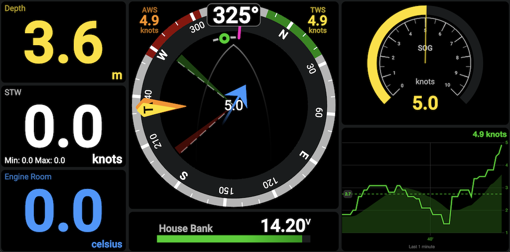

## Table of Content
- [Installations Showcase](#installations-showcase)
- [Design Goal](#design-goal)
- [User Experience](#user-experience)
- [Dashboards and Configuration](#dashboards-and-configuration), [Widget Library](#widget-library) & [Historical Data](#historycal-data)
- [Night Modes](#night-modes)
- [Remote Control](#remote-control-other-skip-displays)
- [Kiosk Mode](#dedicated-fullscreen-instrument-display-kiosk-mode)
- [Progressive Web App (PWA)](#progressive-web-app-pwa)
- [Multiple User Configurations](#multiple-user-configurations)
- [How To Contribute](#how-to-contribute) & [Creating Your Own Widgets](#skip-widgets)
- [Connect, Share, and Support](#connect-share-and-support) & [Features, Ideas, Bugs](#features-ideas-bugs)

## Installations Showcase

In addition to the obvious navstation, wall mounted instrument panel and autopilot remote control usecases using PCs, tablets and phones, users have taken Skip into the elements using Raspberry Pi, Pi Zero, rugged tablets and all kinds of low cost AliExpress screens and industry leading, high quality, sunlight readable marine touch screens. Skip's native remote control feature opens up all kinds of possibilities.

## Read the Help Introduction How-To
You just installed Skip and you're stuck; read the [Introduction](src/assets/help-docs/welcome.md) help file.

# Design Goal
The goal is to replicate and enhance the functionality of modern marine instrumentation displays while providing unmatched customization and flexibility. The design principles include:

- **Full-Screen Utilization**: Ensure the display uses the entire screen without requiring scrolling, maximizing visibility, usability reducing onscreen control clutter.
- **Optimized for Readability**: Present data in a large, clear, and easily interpretable format to ensure quick comprehension. Utilize high-contrast color schemes to enhance visibility, especially in bright daylight conditions.
- **Touchscreen Excellence**: Deliver an intuitive and seamless experience for touchscreen users, with support for gestures like swiping and tapping.
- **Cross-Device Compatibility**: Guarantee a consistent and responsive experience across phones, tablets, computers, and other devices.
- **Modern Browser Support**: Include support for the latest versions of Chromium and other modern web browsers to ensure optimal performance and compatibility.


## User Experience

### Interactions
- **Touch:** swipe left/right to move between pages, swipe down from the top to reveal the auto-hiding toolbar, and tap a page's icon to jump straight to it.
- **Mouse:** scroll to change pages, click the top peek strip (or scroll up) to reveal the toolbar, and click any control.
- **Keyboard:** single-key shortcuts for the essentials — <kbd>←</kbd>/<kbd>→</kbd> change pages, <kbd>E</kbd> edit, <kbd>F</kbd> fullscreen, <kbd>N</kbd> night mode, <kbd>Esc</kbd> cancel an edit.

### Customize
- Effortlessly create and customize dashboards using an intuitive grid layout system.
- Add, resize, and align widgets to design tailored displays for your specific needs.
- Duplicate widgets or entire dashboards, including their configurations, with a single click.
- Reorder pages by dragging, and give each a unique icon and name — open the toolbar's **Manage pages** panel, tap a page, and choose Edit.
- Easily switch between multiple user and device configurations profiles for different roles, formfactors or use cases.

An auto-hiding toolbar keeps the screen clutter-free and puts navigation one tap away: page icons to jump between pages, a **Manage pages** button, and a menu for Settings, Connection, Remote Control, and Help.

## Dashboards and Configuration

### Customizable and Easy
Meant to build purposeful dashboards with however many widgets you want, wherever you want them.

Add, resize, and position the widgets of your choosing. Need more? Add as many pages as you wish to keep your display purposeful. Swipe left and right to cycle through pages, or tap a page's icon in the toolbar to jump straight to it — the current page is always clearly highlighted.

Widget lists are sorted by category.
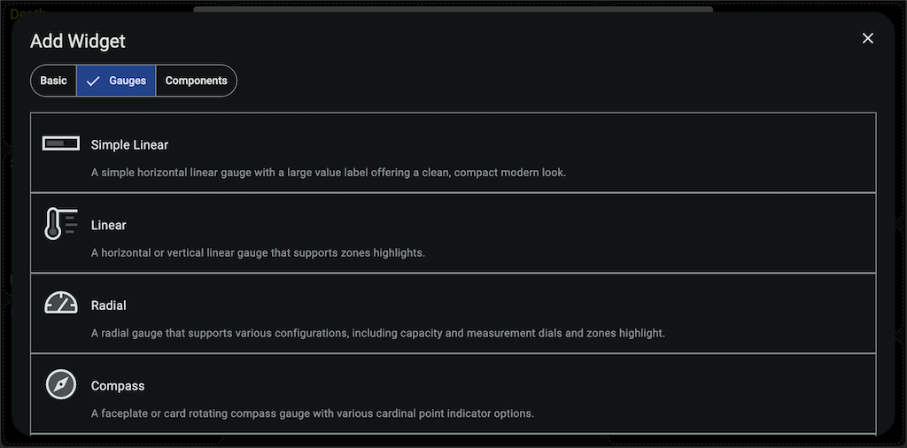

Intuitive widget configuration.
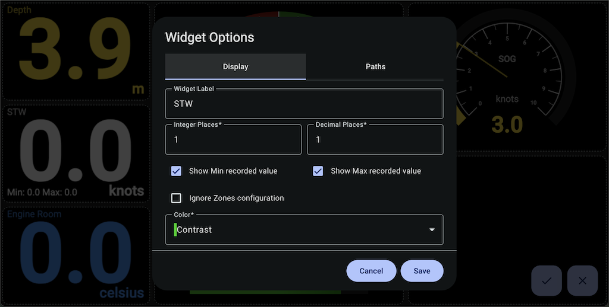

See what Signal K has to offer that you can leverage with widgets. Select it and tweak the display options to suit your purpose.
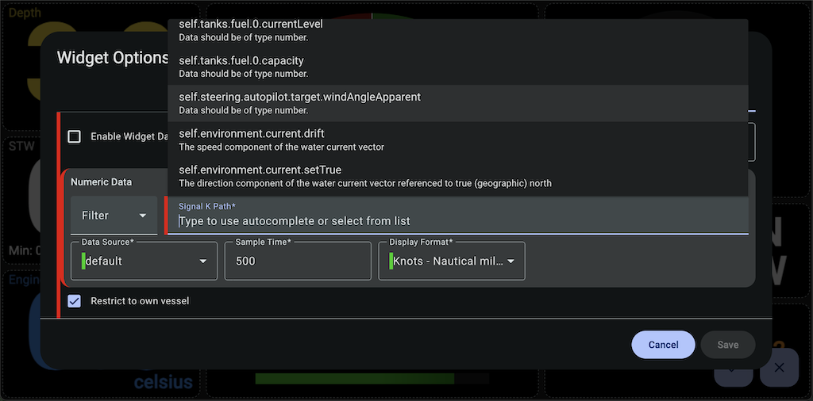

Many units are supported. Choose your preferred app defaults, then tweak them widget-by-widget as necessary. Skip will automatically convert the units for you.
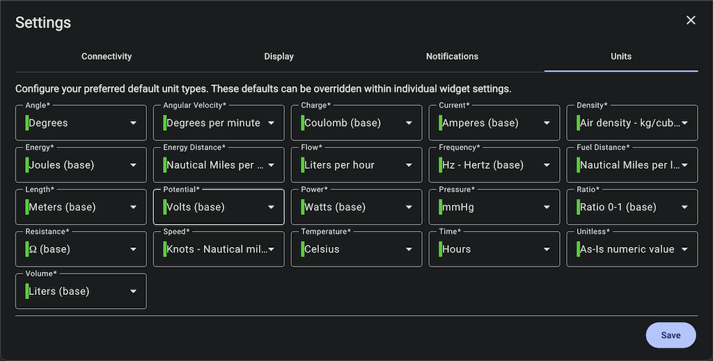

Organize your pages from the toolbar's **Manage pages** panel — add, reorder, rename, duplicate, and delete.

## Widget Library
All Skip widgets are visual presentation controls that are very versatile, with multiple advanced configuration options available to suit your needs:
- **Compact Linear** – Simple horizontal linear gauge with a large value label and modern look.
- **Linear** – Horizontal or vertical linear gauge with zone highlighting.
- **Radial** – Radial gauge with configurable dials and zone highlighting.
- **Compass** – Rotating compass gauge with multiple cardinal indicator options.
- **Level Gauge** – Dual-scale heel angle indicator for trim tuning and sea-state monitoring.
- **Pitch & Roll** – Horizon-style attitude indicator showing live pitch and roll degrees.
- **Classic Steel** – Traditional steel-look linear & radial gauges with range sizes and zone highlights.
- **Windsteer** – Combines wind, wind sectors, heading, COG, and waypoint info for wind steering.
- **Wind Trends** – Real-time True Wind trends with dual axes for direction and speed, live values, and averages.
- **Battery Monitor** - Display batteries or whole banks state State of Charge, remaining capacity, remaining time, voltage, current, power flow, and temperature.
- **Solar Charger**- Track solar generation and charging performance at a glance with live panel output, battery-side metrics, and clear charger and relay status indicators.
- **AC/DC Charger**- Monitor charging performance at a glance with a compact AC/DC Charger Widget. View single or multiple chargers with charge mode, voltage, current, power and temperature. Chargers are discovered automatically.
- **Freeboard-SK** – Adds the Freeboard-SK chart plotter as a widget with automatic sign-in.
- **Autopilot Head** – Typical autopilot controls for compatible Signal K Autopilot devices.
- **Realtime Data Plot** – Visualizes data on a real-time plot with actuals, averages, and min/max.
- **AIS Radar**: Display AIS targets with range rings, interactive target details, and quick zoom and filtering controls.
- **Embed Webpage Viewer** – Embeds external web apps (Grafana, Node-RED, etc.) into your dashboard.
- **Racesteer** – Race steering display fusing polar performance data with live conditions for optimal tactics.
- **Racer - Start Line Insight** – Set and adjust start line ends, see distance, favored end, and line bias; integrates with Freeboard SK.
- **Racer - Start Timer** – Advanced racing countdown timer with OCS status and auto dashboard switching.
- **Countdown Timer** – Simple race start countdown timer with start, pause, sync, and reset options.

Get the latest version of Skip to see what's new!

### Widget Samples
Gauges sample
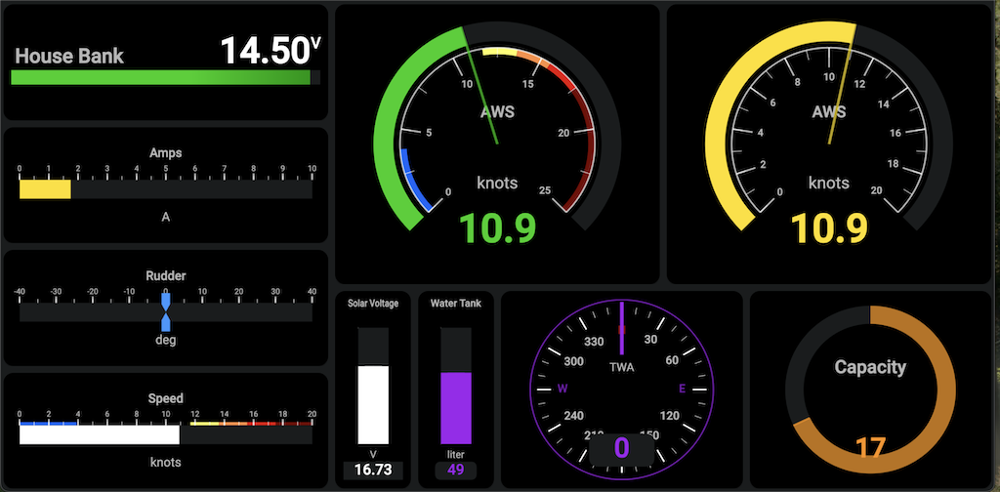

Various other types of widgets
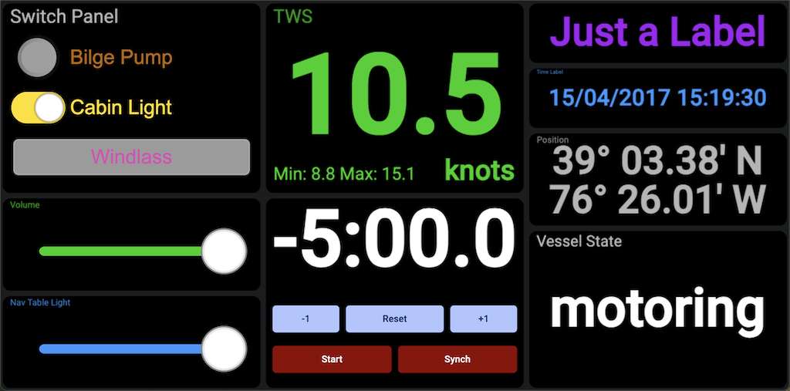

Freeboard-SK Chartplotter integration with Autopilot widget
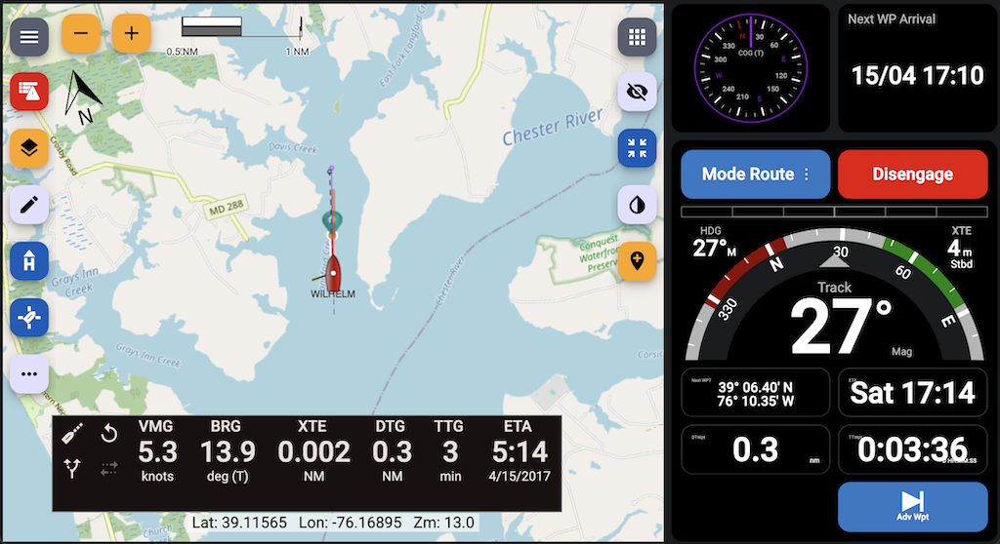

Grafana integration with other widgets
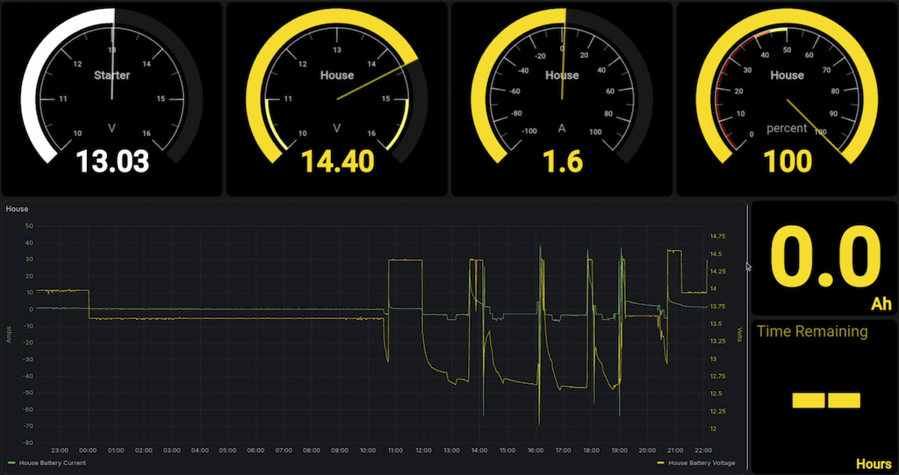

## Historical Data
Skip plots recent history for your numeric data by reading it from an external Signal K History API provider (such as `signalk-to-influxdb2` or `signalk-parquet`). Press and hold (long-press) a widget to open its history dialog, or use a Realtime Data Plot or Wind Trends widget to see recent trends. Skip does **not** record or store data itself — the detail and time span available depend on whatever provider your Signal K server runs, and plots show live data only when no provider is present. See the [History-API Provider](src/assets/help-docs/history-api.md) help file for setup.

## Night Modes
Keep your night vision with automatic or manual day and night switching to a color preserving dim mode or an all Red theme. The images below look very dark, but at night... they are perfect!

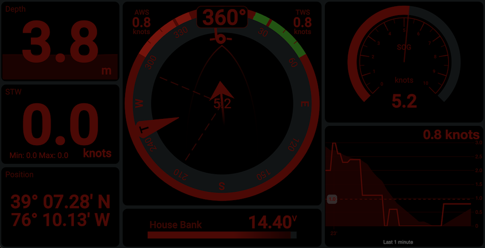

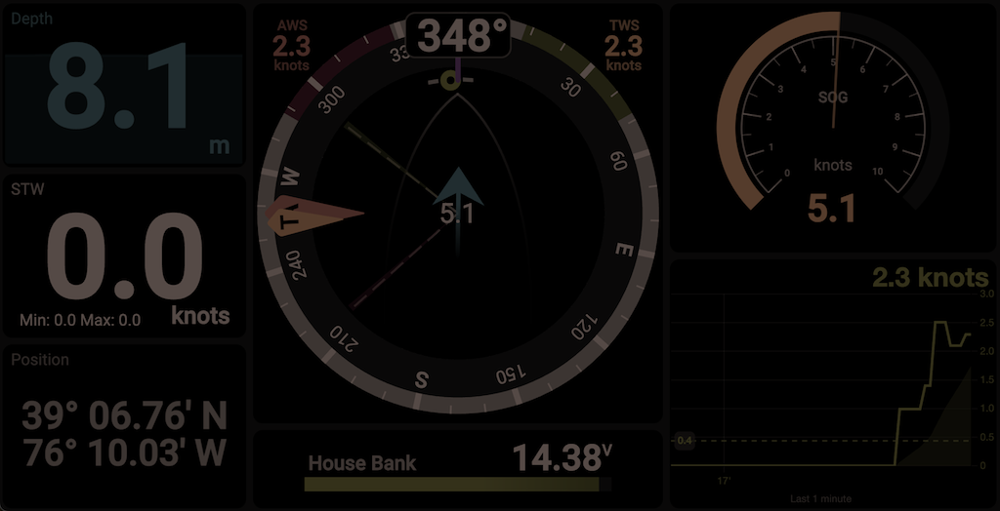

## Remote Control Other Skip Displays
Control which dashboard is shown on another Skip instance (e.g., a mast display, hard-to-reach screen, or a non‑touch device) from any Skip, including your phone.

Use cases
- Mast display: change dashboards from the cockpit.
- Wall/helm screens: toggle dashboards without standing up or reaching for controls.
- Non‑touch/no input: select dashboards when no keyboard/mouse is connected or touch is not supported/disabled.

## Dedicated Fullscreen instrument display (Kiosk Mode)
Runs Skip on Raspberry Pi as a single full-screen application, suppresses the desktop UI and stays on screen like a dedicated chartplotter or marine instrument panel at a fraction of the cost. Read the [Kiosk Mode](src/assets/help-docs/kiosk.md) help file.

## Progressive Web App PWA
Run Skip without browser controls, just like a native computer, tablet or phone app. This feature is supported on most mobile operating systems and desktop browser. It freezes up screen real estate and offers a native Android and iOS app experience with single icon launch. Follow your browser's instructions to install Progressiver Web Apps. It's usually just a few clicks, such as "Add to Home Screen".

## Multiple User Configurations
If you have different roles on board: captain, skipper, tactician, navigator, engineer—or simply different people with different needs, each can tailor Skip as they wish. The use of profiles also allows you to tie specific configuration arrangements to use cases or device form factors.

## Complementary Components
Typical complementary components you may install (most are often bundled with Signal K distributions):

**Navigation & Charting**
- **Freeboard‑SK** (pre-installed) – Multi‑station, web chart plotter dedicated to Signal K: routes, waypoints, charts, alarms, weather layers, and instrument overlays.

**Visual Flow / Automation**
- **Node‑RED** – Low‑code, flow‑based wiring of devices, APIs, online services, and custom logic (alert escalation, device control automation, data enrichment, protocol bridging).

**Data Storage & Analytics**
- **InfluxDB / other TSDB** – High‑resolution historical storage of sensor & performance metrics beyond what lightweight widget plots should retain.
- **Grafana** – Rich exploratory / comparative dashboards, ad‑hoc queries, alert rules on stored metrics, correlation across heterogeneous data sources.

## Harness the Power of Data State Notifications
Stay informed with notifications about the state of the data you are interested in.
For example, Signal K will notify Skip when a water depth or temperature sensor reaches certain levels. In addition to Skip's centralized notification menu, individual widgets offer tailored visual representations appropriate to their design objectives, providing an optimal user experience.

# How To Contribute
Skip is under the MIT license and is built with Node and Angular using various open-source assets. All free! The project want's to insure your time is well invested by favouring discussion before submitting bug fixes and new features.

Please ensure you submit an issue (bug/feature) before submitting a pull request.

## Project Scope
What Skip IS about:
- Real‑time presentation of vessel & environment data (navigation, performance, systems) pulled from Signal K.
- Fast, legible, touchscreen‑friendly dashboards for underway decision making.
- Configurable widgets (gauges, plots, timers, controls) tuned for sailing operations.

What Skip deliberately IS NOT trying to become:
- A full data lake / long‑term time‑series historian.
- A general purpose automation / rules / orchestration engine.
- A universal external web‑app embedding or mash‑up framework.
- A low‑code integration hub for arbitrarily wiring protocols and services.

Those domains already have excellent, specialized open‑source tools. Instead of re‑implementing them, Skip plays nicely alongside them within a Signal K based onboard stack.

### Processing, Extensions and Widgets

#### Signal K Plugins
Domain‑specific enrichment (polars, performance calculations, derived environmental data, routing aids) published directly into the Signal K data model that Skip can then display.

#### Skip Widgets
Visual data representation component that use Signal K path data and API V2 features. Scaffolding a new widgets only takes a few moments and is backed by Skip AI agent instructions providing willed creative minds a personal assistant programmer.

Run one simple command (example):
```
npm run generate:widget
```
or ask your AI to create a widget using the Skip project AI instructions.

For deeper details you can still look at `COPILOT.md`, but you don’t need to in order to get started.

### Why this separation matters

Keeping Skip focused preserves responsiveness (lower CPU / memory), reduces UI clutter, and accelerates core sailing user experience development. Heavy analytics, complex workflow logic, and broad third‑party embedding stay where they are strongest—outside—but still feed Skip through the common Signal K data fabric.

In short: use Skip to see & act on live sailing information; use the complementary tools to store it long‑term, analyze it deeply, automate decisions, or build advanced integrations.

## Getting Started

**Linux, Mac, RPi, or Windows dev platform supported**
1. Download your favorite coding IDE (we use the free Visual Studio Code)
2. Create your own GitHub Skip fork.
3. Configure your IDE's source control to point it to your forked Skip instance (Visual Studio Code, GitHub support is built-in) and get the fork's main branch locally.
4. Install `npm` and `node`. On macOS, you can use `brew install node` if you have Homebrew. See https://nodejs.org/en/download for more options.
5. Install the Angular CLI using `npm install -g @angular/cli`

**Project Setup**
1. From your fork's main branch, create a working branch with a name such as: `new-widget-abc` or `fix-issue-abc`, etc.
2. Check out this new branch.
3. In a command shell (or in the Visual Studio Code Terminal window), go to the root of your local project folder, if not done automatically by your IDE.
4. Install project dependencies using the NPM package and dependency manager: run `npm install`. NPM will read the Skip project dependencies, download, and install everything automatically for you.
5. Build the app locally using Angular CLI: from that same project root folder, run `npm run build:prod`. The CLI tool will build Skip.

**Code and Test**
1. Fire up your local Skip development instance with `npm run dev`.
2. Hit Run/Start Debugging in Visual Studio Code or manually point your favorite browser to `http://localhost:4200/@halos-org/skip`. Alternatively, to start the development server and allow remote devices connections, such as with your phone or RPi (blocked for security reasons by default):  
   `ng serve --configuration=dev --serve-path=/@halos-org/skip/ --host=<your computer's IP> --port=4200`
3. Voila!

*As you work on source code and save files, the app will automatically reload in the browser with your latest changes.*  
*You will also need a running Signal K server for Skip to connect to and receive data. You could also use https://demo.signalk.org but without authentication enabled, your actions, features and test coverage will be limited.*

**Apple PWA Icon Generation**

Use the following tool and command line:  
`npx pwa-asset-generator ./src/assets/favicon.svg ./src/assets/ -i ./src/index.html -m ./src manifest.json -b "linear-gradient(to bottom, rgba(255,255,255,0.15) 0%, rgba(0,0,0,0.15) 100%), radial-gradient(at top center, rgba(255,255,255,0.40) 0%, rgba(0,0,0,0.40) 120%) #989898" -p 5%`

**Share**

Once done with your work, from your fork's working branch, make a GitHub pull request to have your code reviewed, merged, and included in the next release. It's always optimal to sync with us prior to engaging in extensive new development work.

## Development Instructions & Guidelines Documentation

For comprehensive development guidance, please refer to these instruction files:

### Primary Instructions
- **[CLAUDE.md](./CLAUDE.md)**: The authoritative repo guide — architecture, commands, the testing model, and fork-specific gotchas. **Start here.**
- **[Project Instructions](./.github/instructions/project.instructions.md)**: Skip policy for architecture/domain rules, including widget creation and Host2 contracts.
- **[Angular Instructions](./.github/instructions/angular.instructions.md)**: Modern Angular v21+ coding standards, component patterns, and framework best practices.
- `COPILOT.md` and `.github/copilot-instructions.md` are inherited from upstream Kip — useful as loose architecture context, but partly stale; verify any command or claim against CLAUDE.md and the code.

### Development Workflow
1. **Start Here**: Read `CLAUDE.md` for architecture, commands, and the testing model; then `.github/instructions/project.instructions.md` for Skip policy contracts.
2. **Angular Standards**: Follow `.github/instructions/angular.instructions.md` for modern Angular development.
3. **Architecture Context**: Use `COPILOT.md` for rationale and dated architecture notes.
4. **Setup & Build**: Use this README for project setup and build commands.

### Widget Creation Workflow
1. Scaffold with `npm run generate:widget` (Host2 schematic-first path).
2. Use `docs/widget-schematic.md` for CLI flags, prompting behavior, and troubleshooting.
3. Follow Host2 runtime/stream patterns in `.agents/skills/kip-host2-widget/SKILL.md`.
4. Apply widget creation implementation checklist from `.agents/skills/kip-widget-creation/SKILL.md`.
5. Keep enforceable behavior aligned with `.github/instructions/project.instructions.md` (`Widget Creation Domain Rules`).

### Key Priorities
- **Widget Development**: Use Host2 patterns and scaffold with the `create-host2-widget` schematic (see `docs/widget-schematic.md`).
- **Angular Patterns**: Use signals, standalone components, and modern control flow.
- **Theming**: Follow Skip's theme system for consistent UI.
- **Code Quality**: Run `npm run lint` before commits.

Skip is open-source under the MIT license, built by the community and 100% free. Contribute to the project on [GitHub](https://github.com/halos-org/skip)!

# Connect, Share, and Support
Report issues and request features on [Skip's GitHub project](https://github.com/halos-org/skip/issues). Skip is a fork of [Kip](https://github.com/mxtommy/Kip); the upstream Kip community chats on [Discord](https://discord.gg/AMDYT2DQga).

# Features, Ideas, Bugs
See [Skip's GitHub project](https://github.com/halos-org/skip/issues) for the latest feature requests and bug reports.

This repository may not be used to train machine learning or AI models
without explicit permission from the author.
