<p align="center">
  
</p>

# Skip – Signal K Marine Instrument Panel

---

[](src/assets/help-docs/welcome.md)
[](src/assets/help-docs/community.md)
[](src/assets/help-docs/contact-us.md)

**Skip is a Signal K marine instrument panel and dashboard: equally at home under a finger, a mouse, or a keyboard, and ready to use across all your devices.**

Skip turns your Signal K data into clear, purpose-built instrument dashboards. Install it from the Signal K app store, then open Skip in a browser and it's ready to go. A single instance works everywhere — no per-device deployment is needed.

Skip is designed for sailors and boaters who want:

- A **ready-to-use, classic marine app experience** with minimal setup.
- A **modern, polished interface** optimized for marine displays.
- **Every input treated as first class**: touch targets sized for a tablet on a moving boat, pointer and keyboard paths that are just as direct at the navstation — no input reduced to a fallback.
- **Cross-platform support**: runs on phones, tablets, laptops, Raspberry Pi, Web Enabled TV or other fixed displays - anywhere you can run a web browser.
- **Instant access to all Signal K data**: displays gauges, graphs, switches, and other widgets right out of the box.
- **Flexible dashboards**: customize layouts, drag-and-drop widgets, night/day mode, kiosk/fullscreen and remote control support.

With Skip, you get the **clarity of a purpose-built marine instrument panel** combined with the flexibility of Signal K. It's simple, reliable, and highly usable — a modern instrument panel for [Signal K](https://signalk.org) vessels, whatever you drive it with.

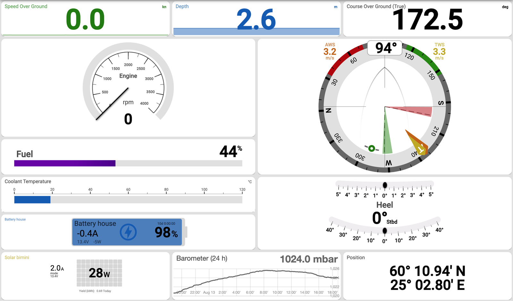

## Table of Contents
- [Where Skip Runs](#where-skip-runs)
- [Design Goals](#design-goals)
- [Using Skip](#using-skip): [toolbar](#the-auto-hiding-toolbar), [pages](#pages), [editing](#editing-a-page), [widget settings](#configuring-a-widget)
- [Display Units](#display-units)
- [Widget Library](#widget-library)
- [Historical Data](#historical-data)
- [Day, Dark, and Night Modes](#day-dark-and-night-modes)
- [Remote Control](#remote-control-other-skip-displays)
- [Kiosk Mode](#dedicated-fullscreen-instrument-display-kiosk-mode)
- [Multiple Profiles](#multiple-profiles)
- [How To Contribute](#how-to-contribute) & [Extending Skip](#extending-skip)
- [Connect, Share, and Support](#connect-share-and-support) & [Features, Ideas, Bugs](#features-ideas-bugs)

## Where Skip Runs


Skip runs anywhere a modern browser does. Beyond the obvious navstation, wall-mounted instrument panel, and autopilot-remote uses on PCs, tablets, and phones, it suits the elements just as well — Raspberry Pi and Pi Zero displays, rugged tablets, low-cost screens, and industry-leading sunlight-readable marine touchscreens alike. Its built-in remote control opens up multi-display setups across the boat.

The same instance serves every one of them. Each page reflows to the screen it is shown on, so a portrait wall panel and a phone in your pocket both get a full-screen layout rather than a scaled-down desktop one.

| Portrait display | Phone |
| --- | --- |
| 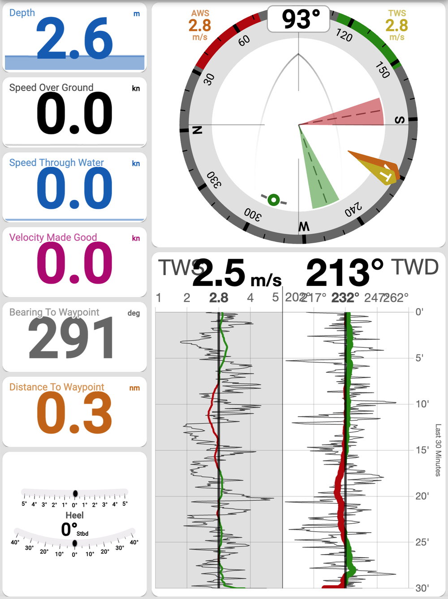 | 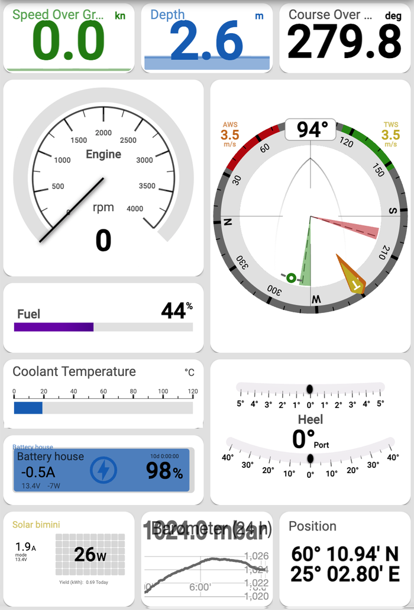 |

In the phone screenshot, the barometer graph draws its title over its value. That is a defect, not the intended layout — see [issue #595](https://github.com/halos-org/skip/issues/595).

# Design Goals

Skip has two guiding goals: **flawless usability** and **seamless integration with Signal K**.

**Flawless usability.** The display is legible at a glance — large, clear values and high-contrast themes readable in bright daylight — and uses the whole screen without scrolling. Chrome auto-hides so the instruments own the display, and it's genuinely usable on *every* input — touch, mouse, and keyboard alike — not "optimized" for one and awkward on the rest. Features are discoverable: you can start using Skip straight away, without first working through manuals or tutorials.

**Seamless Signal K integration.** Skip is Signal K–native. It signs in through the server's own session (SSO, no separate credentials), takes its display units and metadata/zones straight from the server, and stores none of its own data — history comes from a standard Signal K History API provider. It surfaces whatever your Signal K stack offers and plays cleanly alongside the rest of it (Freeboard-SK, plugins, InfluxDB/Grafana, Node-RED).

## Using Skip

Every control reaches the same command from touch, mouse, and keyboard. Nothing is hidden behind a hover, and nothing needs a right-click.

### The auto-hiding toolbar

Skip has no permanent chrome. The toolbar appears when the app loads, hides after a few seconds, and comes back on demand:

- **Touch:** swipe down from the top edge. Swipe up to send it away.
- **Mouse or trackpad:** scroll up, click the peek strip at the top edge, or rest the pointer there. Scroll down to hide it.
- **Anywhere:** a tap or click on the dashboard dismisses it, and it hides on its own after a few idle seconds.

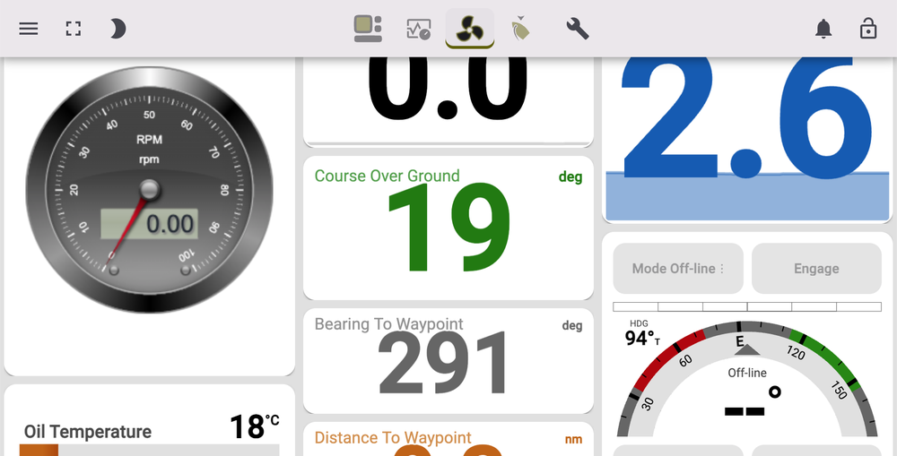

Left to right, the toolbar holds the app menu, fullscreen, and night mode; then the page icons and the **Manage pages** button; then notifications, with a badge for active alarms, and the lock that unlocks the page for editing.

The menu covers everything that is not a per-page action, and reports the Skip version and the server it is connected to.

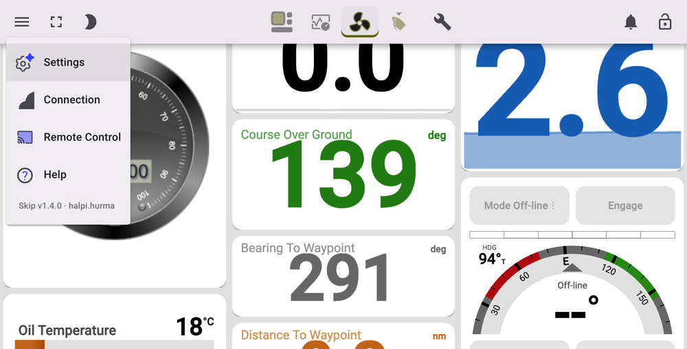

Keyboard users get single-key shortcuts for the essentials: <kbd>←</kbd>/<kbd>→</kbd> change pages, <kbd>E</kbd> edits the page, <kbd>F</kbd> toggles fullscreen, <kbd>N</kbd> toggles night mode, and <kbd>Esc</kbd> cancels an edit. The keys are bare — no modifiers — and they stand down while you are typing in a field or while a dialog is open.

### Pages

Build as many pages as you need and give each one a job: sailing, motoring, anchoring, engine room. Move between them by swiping left and right, scrolling horizontally, pressing <kbd>←</kbd>/<kbd>→</kbd>, or tapping a page's icon in the toolbar. The current page is always highlighted.

The **Manage pages** panel handles the rest — drag a page to reorder it, tap one for Edit, Duplicate, and Delete, or add a new one. Each page carries its own name and icon.

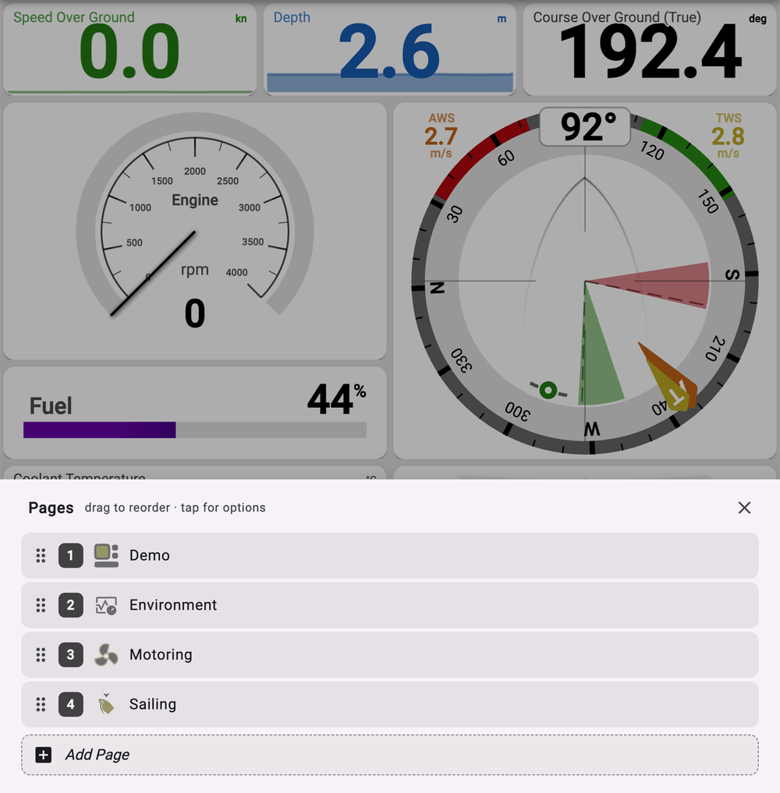

### Editing a page

Unlock the page from the toolbar or press <kbd>E</kbd>. Widgets can then be dragged and resized on a grid that snaps them into alignment. <kbd>Esc</kbd> or the cancel button discards the layout changes; the check button keeps them.

A tap or click on a widget opens its action menu at the point you touched — **Settings**, **Duplicate**, **Copy**, **Cut**, and **Delete**. On phones the same menu slides up as a bottom drawer instead of a pop-over, so the targets stay thumb-sized. Tap empty grid space and you get **Add Widget**, plus **Paste** and **Clear clipboard** once something is on the clipboard.

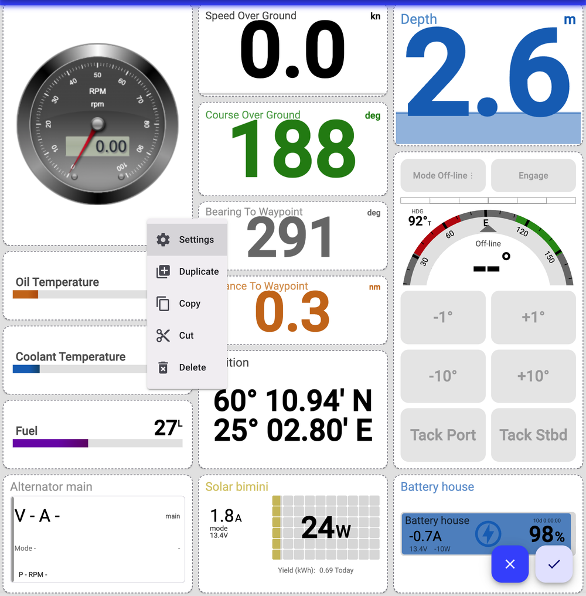

Widgets are listed by category — Core, Gauge, Component, and Racing — each with a description of what it does.

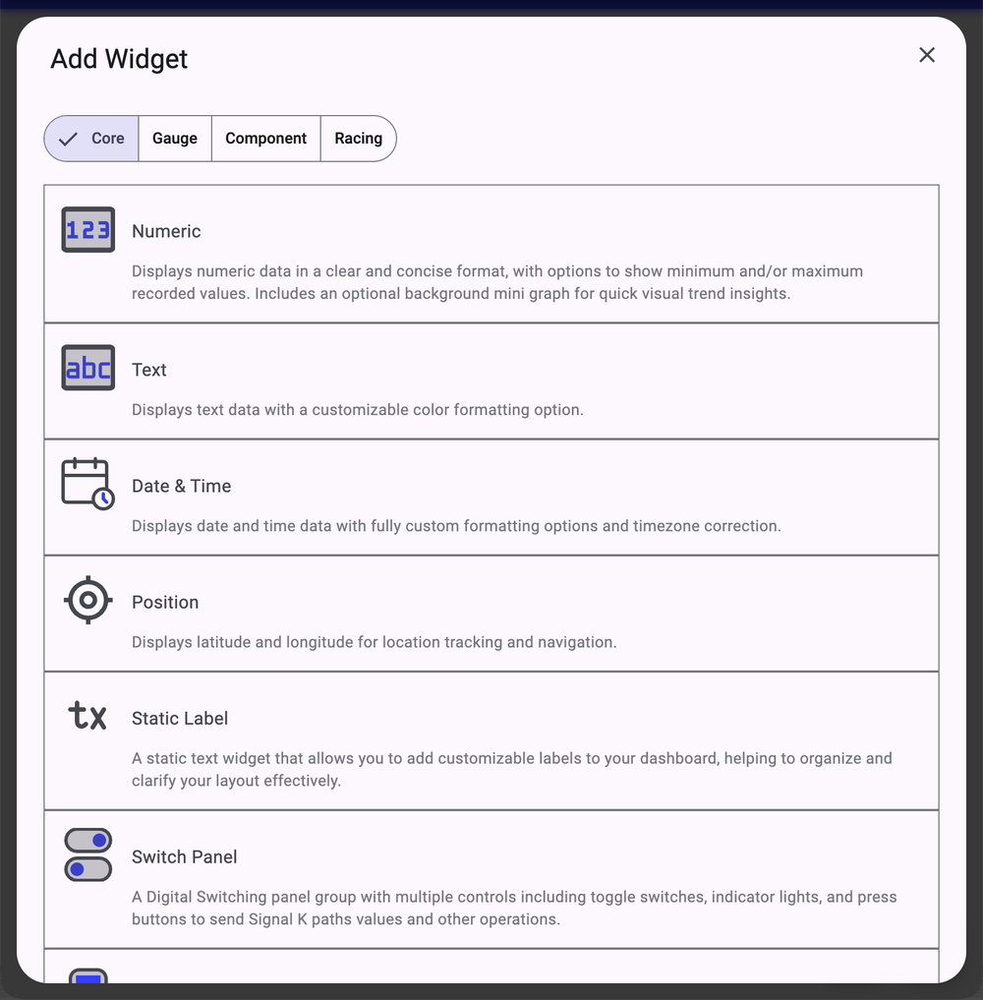

### Configuring a widget

Each widget has a **Display** tab for how it looks and behaves, and a **Paths** tab for the Signal K data it reads.

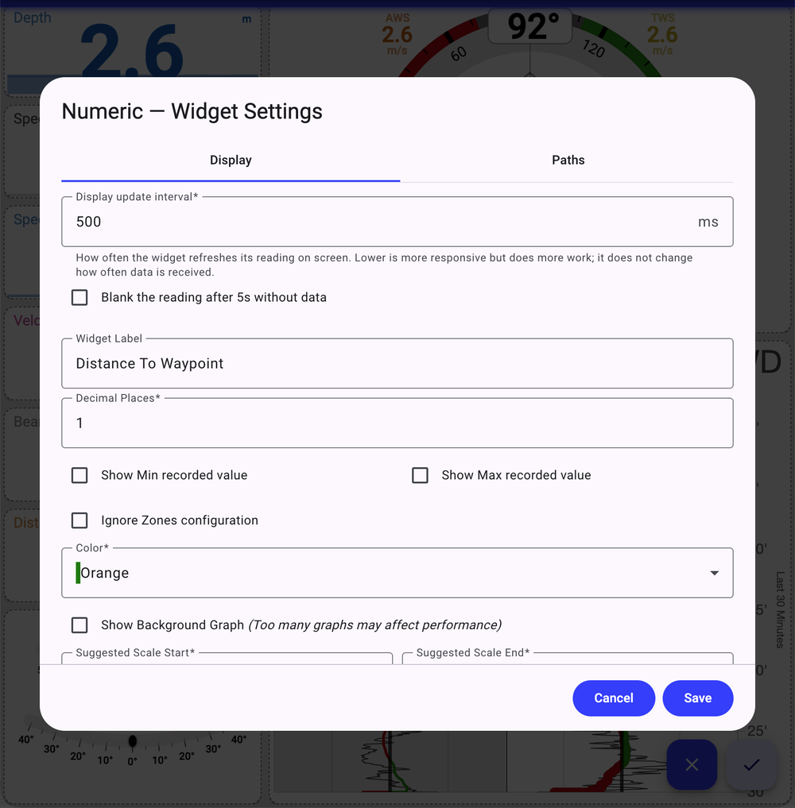

The path picker searches everything your server publishes and shows each path's description, so you can find the right one without leaving the dialog. Where a path has several sources, pick the one you want under **Data Source**, or leave it on **Any** and take whichever source Signal K resolves.

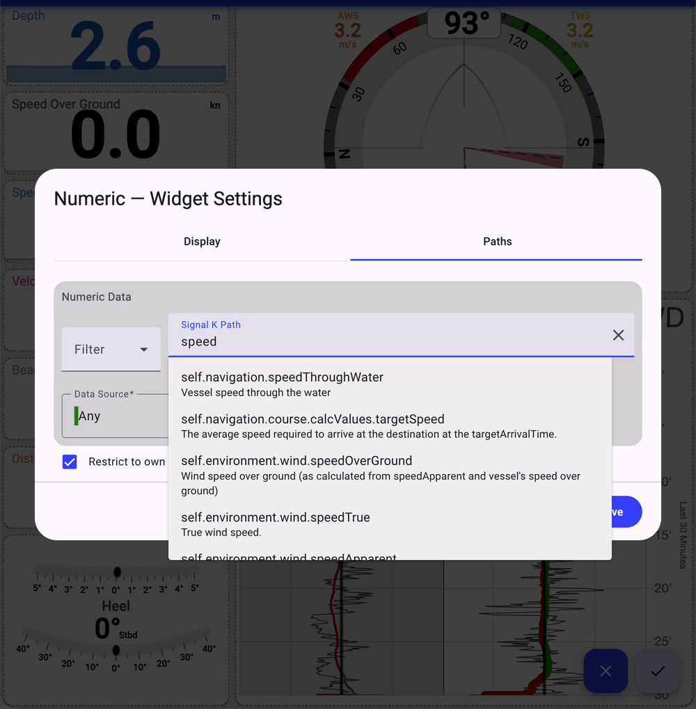

On a locked page, a long press on a widget opens its recent history as a graph — see [Historical Data](#historical-data).

## Display Units

Skip displays every value in the units set by your Signal K server's **unit preferences**, converting automatically — there are no unit settings in Skip to keep in sync. Set your units once on the server and every unit-preferences-aware app, Skip included, follows. Requires Signal K server 2.23.0 or later; on an older server Skip shows values in Signal K's own units (SI: metres, m/s, Kelvin, Pascal, m³/s).

**Where to set them.** In the Signal K server admin UI, go to **Server → Configuration → Settings** and scroll to **Unit Preferences**. Preferences are stored per user, so they follow your login across devices; an anonymous visitor gets the server's default preset.

**Presets** are the quick way in — one choice covers every category:

| Preset | Speed | Distance | Depth | Temperature | Volume |
| --- | --- | --- | --- | --- | --- |
| Metric | km/h | kilometres | metres | Celsius | litres |
| Nautical (Metric) | knots | nautical miles | metres | Celsius | litres |
| Imperial (US) | mph | miles | feet | Fahrenheit | US gallons |
| Imperial (UK) | mph | miles | feet | Celsius | imperial gallons |
| Nautical Imperial (US) | knots | nautical miles | feet | Fahrenheit | US gallons |
| Nautical Imperial (UK) | knots | nautical miles | feet | Celsius | imperial gallons |

**Categories** are how one preset reaches hundreds of paths. Every numeric path belongs to a category — `speed`, `distance`, `depth`, `temperature`, `pressure`, `angle`, `volume`, `volumeRate`, `frequency`, `time`, `percentage`, the electrical group, and the rest — and the preset picks one unit per category. Set `speed` to knots and boat speed, wind speed, and every other speed path follow at once.

**Per-path overrides** handle the exceptions: boat speed in knots but wind speed in m/s, or fuel rate in litres per minute rather than litres per hour. Override a single path in the admin UI's Data Browser — open the path's meta editor and pick a unit under the `custom` category, or select `base` to see the raw Signal K value. Overrides win over the preset.

**Custom presets and units** cover the rest. The server accepts uploaded presets and custom unit definitions through its `/signalk/v1/unitpreferences/*` API, so a unit combination that no built-in preset offers can still drive every client. Signal K's own [Unit Preferences guide](https://github.com/SignalK/signalk-server/blob/master/docs/guides/unitpreferences.md) documents the full API and the standard category list.

**What Skip does with it.** Skip reads each path's preference from the server's metadata, applies the conversion, and labels the value with that unit — the label always matches the conversion applied. When the server states no preference for a path, Skip shows the Signal K value as-is with no unit label rather than guessing. Where the server asks for a unit Skip has no conversion for, it does the same and names the unit in the browser console (`[Units Service] Server display unit '<unit>' …`), which is worth quoting in a bug report.

## Widget Library

Every widget is a visual presentation control with configuration options of its own. The Add Widget dialog groups them into four categories. A few widgets read data that a Signal K plugin has to publish; those are named below, and the Add Widget dialog lists each widget's dependencies and marks the ones your server is missing.

**Core** — the everyday readouts and controls.

- **Numeric** – Numeric data with optional min/max recorded values and an optional background mini graph.
- **Text** – Text data with a customizable color.
- **Date & Time** – Date and time with custom formatting and timezone correction.
- **Position** – Latitude and longitude.
- **Static Label** – A fixed text label for organizing a layout.
- **Switch Panel** – A digital switching panel of toggles, indicator lights, and press buttons that send Signal K path values.
- **Multi-State Switch** – Lists a device's operating modes (On, Off, Charge Only, …), highlights the current one, and sends a new one.
- **Zones State Panel** – The severity and message of a path's zones, from the Signal K metadata.
- **Slider** – A range slider for values such as lighting intensity or audio volume.

**Gauge** — analog-style and electrical instruments.

- **Compact Linear** – Simple horizontal linear gauge with a large value label.
- **Linear** – Horizontal or vertical linear gauge with zone highlighting.
- **Radial** – Radial gauge with configurable capacity and measurement dials, plus zone highlighting.
- **Compass** – Faceplate or card-style rotating compass with several cardinal indicator options.
- **Level Gauge** – Dual-scale heel indicator: a ±5° fine level for trim tuning and a ±40° arc for sea state.
- **Pitch & Roll** – Horizon-style attitude indicator with live pitch and roll degrees.
- **Classic Steel** – Traditional steel-look linear and radial gauges with range sizes and zone highlights.
- **Battery Monitor** – Battery banks and individual batteries: state of charge, current, voltage, power, temperature, capacity, and time remaining.
- **Solar Charger** – Live panel output, battery-side metrics, and charger and relay status.
- **AC/DC Charger** – Charger output and charging state with voltage, current, power, temperature, and stage indicators.
- **Alternator** – Alternator output: voltage, current, power, revolutions, and temperature.
- **Inverter** – Inverter input and output with AC voltage, current, power, temperature, state, and mode.
- **AC Monitor** – AC bus and line-level loads: voltage, current, frequency, and power.

**Component** — larger, composite displays.

- **Windsteer** – Combines wind, wind sectors, heading, course over ground, and next waypoint into one steering display.
- **Freeboard-SK** – Adds the Freeboard-SK chart plotter as a widget, with automatic sign-in. Needs Freeboard-SK itself plus the `tracks`, `resources-provider`, and `course-provider` plugins; Signal K server ships all four.
- **Autopilot Head** – Autopilot controls for Signal K v1 and v2 Autopilot API devices.
- **Data Graph** – Graphs any numeric path over a configurable window, with actuals, moving and period averages, and min/max.
- **Hoeken's Anchor Alarm** – Map-first anchor alarm with circle, sector, and polygon watch zones, a scope calculator, and track overlays. Needs the `hoekens-anchor-alarm` plugin.
- **Anchor Watch** – Server-side drift detection with a configurable alarm radius, automatic radius from rode and depth, position history, and GPS bow-offset compensation. Needs the `anchoralarm` plugin.
- **AIS Radar** – AIS targets with range rings, interactive target details, and quick zoom and filtering.
- **Embed Webpage Viewer** – Embeds external web apps (Grafana, Node-RED, other Signal K apps) into your dashboard.
- **Video** – Plays video from a URL with built-in player controls.

**Racing** — start-line and performance tools.

- **Racesteer** – Fuses polar performance data with live conditions to guide steering, tacking, and gybing angles. Needs the `signalk-polar-performance-plugin` plugin for its polar data. Skip lists it as **Racesteer (BETA)** in the Add Widget dialog.
- **Racer - Start Line Insight** – Set and adjust the start line ends, and see distance to the line, the favored end, and the bias. Integrates with Freeboard-SK. Needs the `signalk-racer` plugin.
- **Racer - Start Timer** – Racing countdown with OCS status and automatic switching to a target page at the start. Needs the `signalk-racer` plugin.
- **Countdown Timer** – Simple start countdown with start, pause, sync, and reset.
- **Wind Trends** – Live true wind trends on dual axes for direction and speed, with live values and moving averages.

Get the latest version of Skip to see what's new!

## Historical Data

Skip graphs recent history for your numeric data by reading it from an external Signal K History API provider (such as `signalk-to-influxdb2` or `signalk-parquet`). Press and hold (long-press) a widget to open its history dialog, or use a Data Graph or Wind Trends widget to see recent trends. Skip does **not** record or store data itself — the detail and time span available depend on whatever provider your Signal K server runs, and without a provider both the history dialog and the graph widgets show an empty state. See the [History-API Provider](src/assets/help-docs/history-api.md) help file for setup.

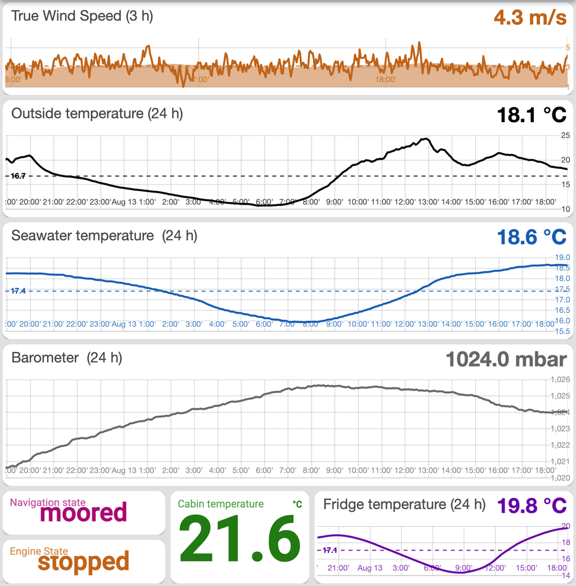

## Day, Dark, and Night Modes

Choose the light theme, the dark theme, or follow the device. On top of that come two night modes that protect your night vision: a color-preserving dim mode whose brightness you set, and an all-red theme. Switch modes from the toolbar or with <kbd>N</kbd>, or let Skip switch on the sun phases. Automatic switching reads the sun phase from the Signal K Derived Data plugin; install that plugin and Skip offers to enable it and turn on its `environment.sun` path for you. The night images below look very dark on a desktop monitor, but at night they are perfect.

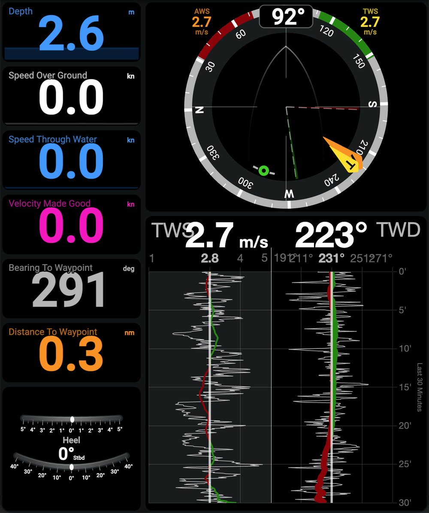

| Night — dim | Night — red |
| --- | --- |
| 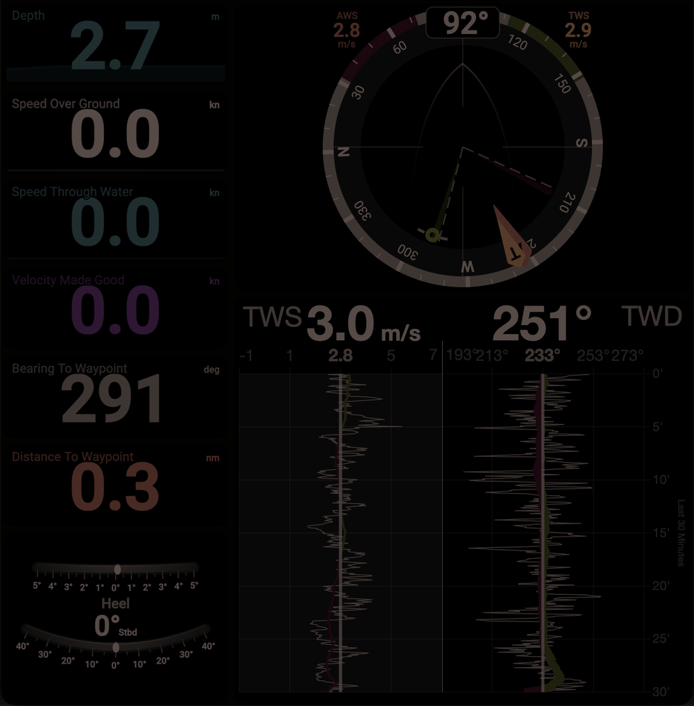 | 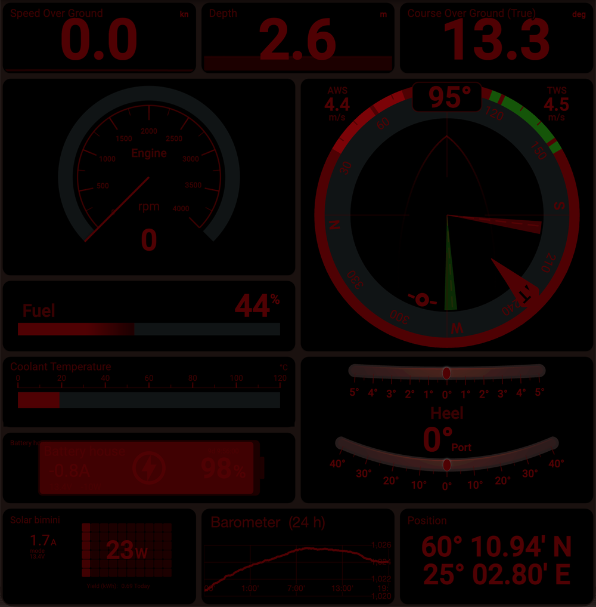 |

## Remote Control Other Skip Displays

Control which dashboard is shown on another Skip instance (e.g., a mast display, hard-to-reach screen, or a non-touch device) from any Skip, including your phone.

Use cases

- Mast display: change dashboards from the cockpit.
- Wall/helm screens: toggle dashboards without standing up or reaching for controls.
- Non-touch/no input: select dashboards when no keyboard/mouse is connected or touch is not supported/disabled.

## Dedicated Fullscreen instrument display (Kiosk Mode)

Runs Skip on Raspberry Pi as a single full-screen application, suppresses the desktop UI and stays on screen like a dedicated chartplotter or marine instrument panel at a fraction of the cost. Read the [Kiosk Mode](src/assets/help-docs/kiosk.md) help file.

## Multiple Profiles

Skip supports multiple named configuration profiles under a single Signal K account — each an independent set of pages, layouts, and theme. Use them to tailor the display per role (captain, navigator, engineer), per use case, or per device form factor. Each device remembers which profile it's showing, so different displays signed in as the same user can each show a different setup.

## Complementary Components

Typical complementary components you may install (most are often bundled with Signal K distributions):

**Navigation & Charting**
- **Freeboard-SK** (pre-installed) – Multi-station, web chart plotter dedicated to Signal K: routes, waypoints, charts, alarms, weather layers, and instrument overlays.

The integration runs both ways. Skip's **Freeboard-SK** widget puts the plotter on a Skip page, and the `@halos-org/skip-freeboard-panel` plugin puts Skip inside Freeboard — a toolbar button that opens Skip in a side panel, plus Wind Steer chart widgets. Skip declares that plugin as a dependency, so installing Skip from the app store brings it along.

**Visual Flow / Automation**
- **Node-RED** – Low-code, flow-based wiring of devices, APIs, online services, and custom logic (alert escalation, device control automation, data enrichment, protocol bridging).

**Data Storage & Analytics**
- **InfluxDB / other TSDB** – High-resolution historical storage of sensor & performance metrics beyond what lightweight widget graphs should retain.
- **Grafana** – Rich exploratory / comparative dashboards, ad-hoc queries, alert rules on stored metrics, correlation across heterogeneous data sources.

## Harness the Power of Data State Notifications

Stay informed with notifications about the state of the data you are interested in.
For example, Signal K will notify Skip when a water depth or temperature sensor reaches certain levels. In addition to Skip's centralized notification menu, individual widgets offer tailored visual representations appropriate to their design objectives, providing an optimal user experience.

# How To Contribute

We are happy to receive GitHub issues and pull requests!

## Extending Skip

Skip is one part of a Signal K stack, and it's easy to extend in two directions:

**Signal K Plugins** — domain-specific enrichment (polars, performance calculations, derived environmental data, routing aids) published into the Signal K data model, which Skip can then display.

**Skip Widgets** — visual components that read Signal K path data and API v2 features. Scaffolding a new one takes only a few moments: run `npm run generate:widget`, or ask your AI to build one from the Skip project instructions. See [CLAUDE.md](./CLAUDE.md) for details.

## Getting Started

You need [Node.js](https://nodejs.org/en/download) 20 or later and npm. Node 24 is what CI builds and tests on. Any editor works; the repo carries Visual Studio Code settings. Skip's dev server needs a Signal K server to talk to. Use your own where you can: https://demo.signalk.org grants anonymous read-only access and hands out no user session, so Skip boots there as a read-only visitor and cannot save a configuration. That is fine for watching live data, and not enough for working on anything that writes.

```bash
git clone https://github.com/halos-org/skip.git     # or your fork
cd skip
npm install
npm run dev
```

`npm run dev` serves the app at http://localhost:4200/@halos-org/skip/ and reloads it as you save. The serve path matters: it is the package name, and Skip's routing and manifest depend on it.

To reach the dev server from another device — a phone, a Raspberry Pi — bind it to your machine's address, which Angular blocks by default:

```bash
npx ng serve --configuration=dev --serve-path=/@halos-org/skip/ --host=<your ip> --port=4200
```

The repository also carries a `./run` dispatcher; `./run help` lists every command.

| Command | What it does |
| --- | --- |
| `npm run dev` / `./run dev` | Dev server with live reload |
| `npm run build:prod` / `./run build` | Production bundle into `public/` |
| `npm test` / `./run test` | Unit suite, headless |
| `npm run lint` / `./run lint` | ESLint |
| `npm run snc` / `./run snc` | Type-check every source under `strictNullChecks` |
| `npm run ci` / `./run ci` | The full gate CI runs: lint, type-check, tests, schema check |
| `npm run generate:widget` | Scaffold a new widget |
| `./run deploy-halos <host>` | Build and install onto a HaLOS device's Signal K |

Run `npm run ci` before you push. It is the same gate the pull request checks apply.

**Share your work.** Branch from `main`, commit, and open a pull request. It's always optimal to sync with us before starting extensive new development.

## Development Instructions & Guidelines Documentation

- **[CLAUDE.md](./CLAUDE.md)** is the authoritative repo guide: architecture, commands, the testing model, Skip's policy contracts, and the gotchas that cost real time. **Start there.**
- Widgets are scaffolded with `npm run generate:widget`; `tools/schematics/create-host2-widget/schema.json` lists its options, and CLAUDE.md documents the Host2 runtime and stream patterns the scaffold produces.
- Skip targets modern Angular: signals, standalone components, the new control flow, and no `any`.

Skip is open-source under the MIT license, built by the community and 100% free. Contribute to the project on [GitHub](https://github.com/halos-org/skip)!

# Connect, Share, and Support

Report issues and request features on [Skip's GitHub project](https://github.com/halos-org/skip/issues). For chat, join the #skip channel on the [Signal K Discord](https://discord.gg/uuZrwz4dCS).

## About Skip

Skip is a Signal K marine instrument panel that originated as a fork of [Kip](https://github.com/mxtommy/Kip) by Thomas St.Pierre and David Godin. It is now an independent project: it adds standard Signal K session/SSO authentication and account-independent named profiles, and has diverged from Kip as it evolves. It is served at `/@halos-org/skip/`. Licensed under MIT (see [LICENSE](LICENSE)).

# Features, Ideas, Bugs

See [Skip's GitHub project](https://github.com/halos-org/skip/issues) for the latest feature requests and bug reports.
