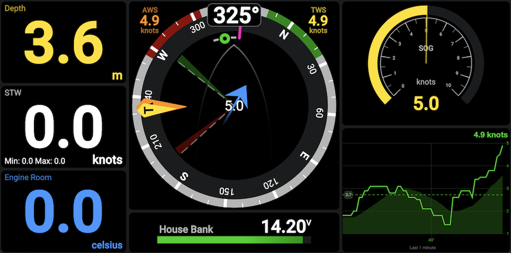
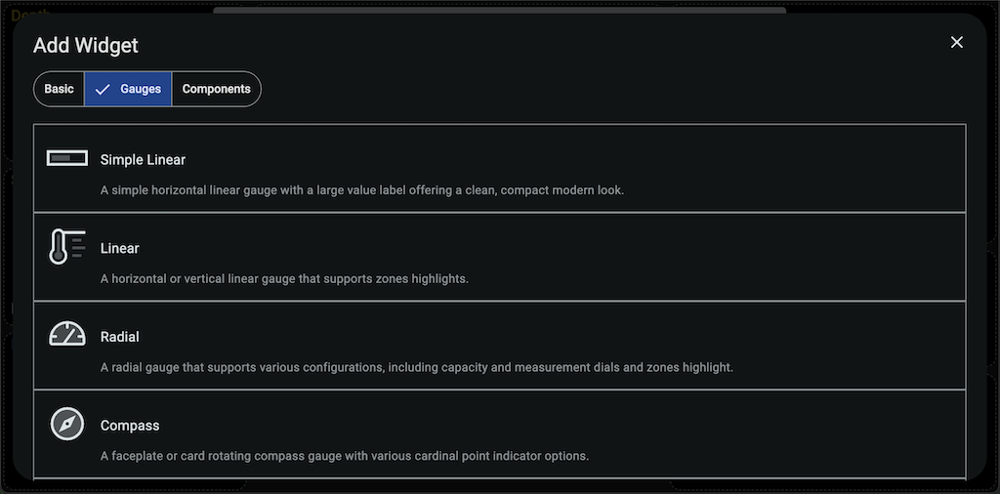
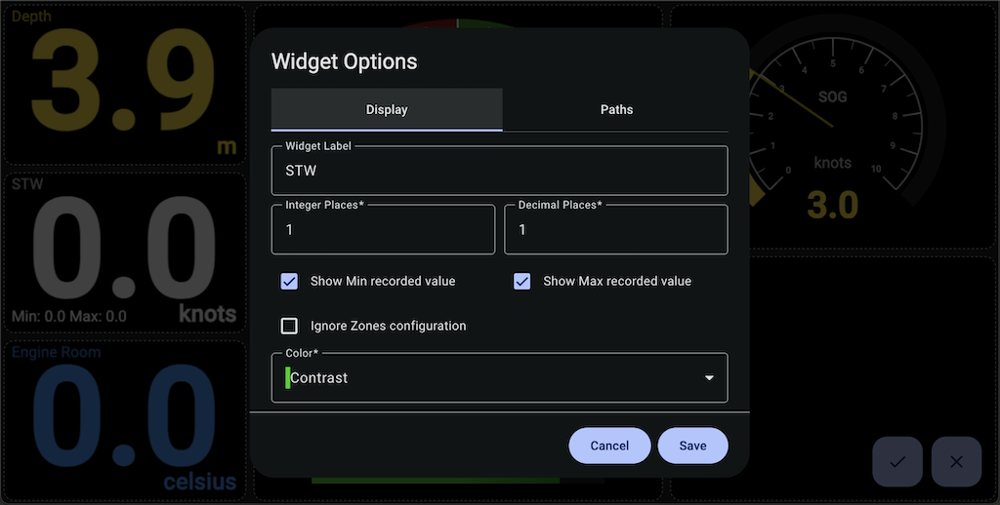
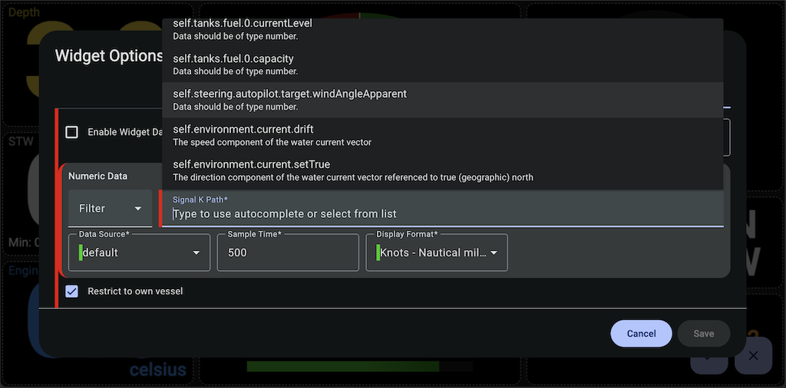
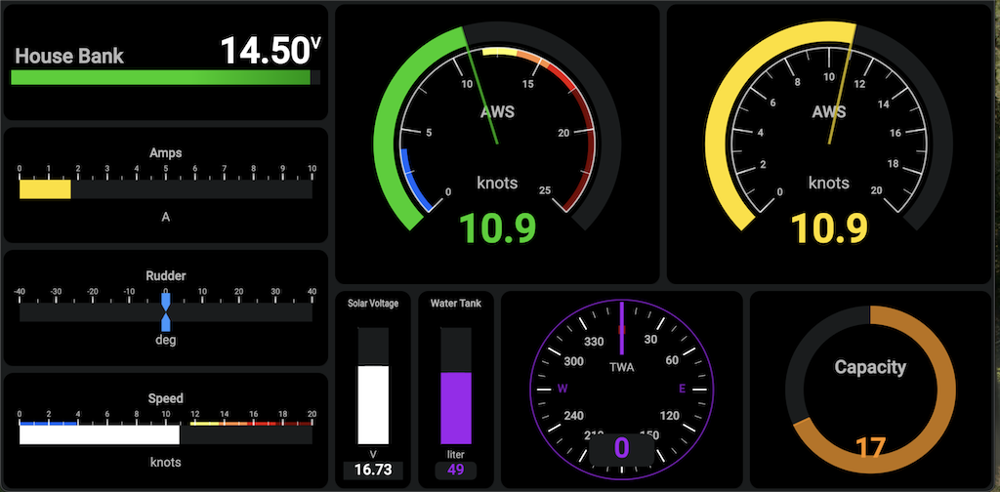
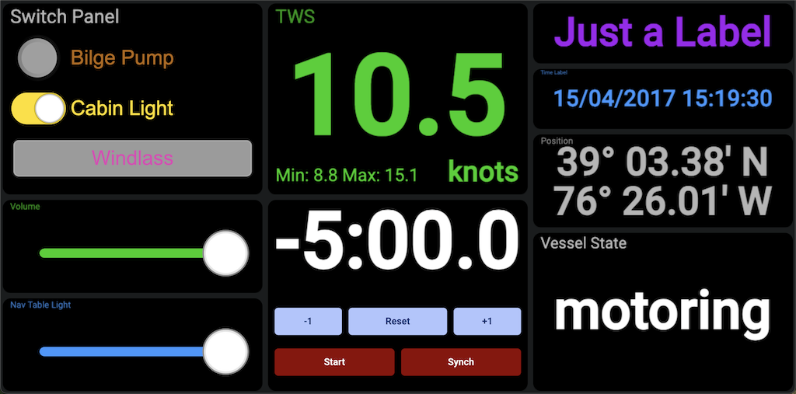
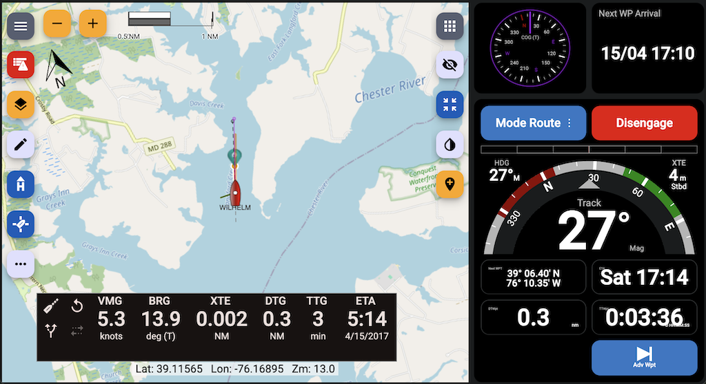
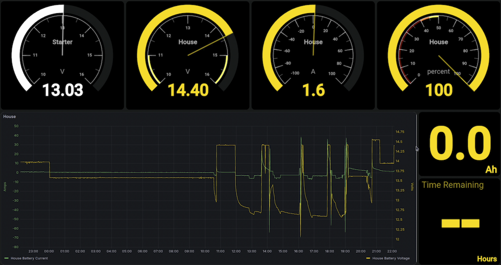
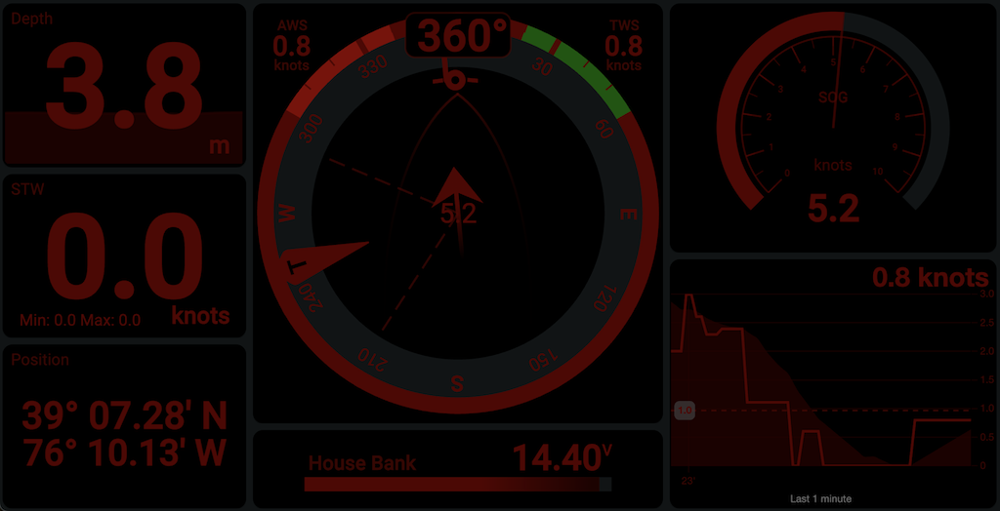
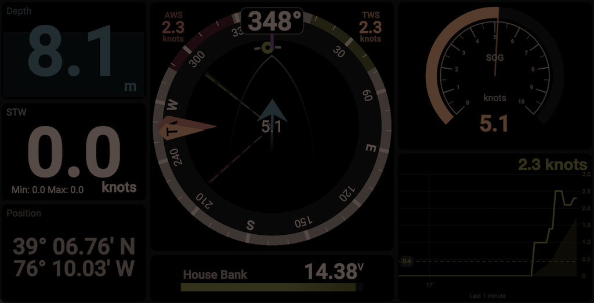

  

# Skip – Signal K Marine Instrument Panel

---

**Skip is a Signal K marine instrument panel and dashboard: touch-optimized and ready-to-use across all your devices.**

Skip turns your Signal K data into clear, purpose-built instrument dashboards. Install it from the Signal K app store, then open Skip in a browser and it’s ready to go. A single instance works everywhere — no per‑device deployment is needed.

Skip is designed for sailors and boaters who want:

- A **ready-to-use, classic marine app experience** with minimal setup.
- A **modern, polished interface** optimized for marine displays.
- **Touch-optimized design**: touch-first, intuitive design for tablets, phones, and other touch-enabled devices.
- **Cross-platform support**: runs on phones, tablets, laptops, Raspberry Pi, Web Enabled TV or other fixed displays - anywhere you can run a web browser.
- **Instant access to all Signal K data**: displays gauges, plots, switches, and other widgets right out of the box.
- **Flexible dashboards**: customize layouts, drag-and-drop widgets, night/day mode, kiosk/fullscreen and remote control support.

With Skip, you get the **clarity of a purpose-built marine instrument panel** combined with the flexibility of Signal K. It’s simple, reliable, and highly usable — a modern, touch-first instrument panel for [Signal K](https://signalk.org) vessels.

## Table of Content
- [Where Skip Runs](#where-skip-runs)
- [Design Goals](#design-goals)
- [User Experience](#user-experience)
- [Dashboards and Configuration](#dashboards-and-configuration), [Display Units](#display-units), [Widget Library](#widget-library) & [Historical Data](#historical-data)
- [Night Modes](#night-modes)
- [Remote Control](#remote-control-other-skip-displays)
- [Kiosk Mode](#dedicated-fullscreen-instrument-display-kiosk-mode)
- [Multiple Profiles](#multiple-profiles)
- [How To Contribute](#how-to-contribute) & [Extending Skip](#extending-skip)
- [Connect, Share, and Support](#connect-share-and-support) & [Features, Ideas, Bugs](#features-ideas-bugs)

## Where Skip Runs

Skip runs anywhere a modern browser does. Beyond the obvious navstation, wall-mounted instrument panel, and autopilot-remote uses on PCs, tablets, and phones, it suits the elements just as well — Raspberry Pi and Pi Zero displays, rugged tablets, low-cost screens, and industry-leading sunlight-readable marine touchscreens alike. Its built-in remote control opens up multi-display setups across the boat.

# Design Goals

Skip has two guiding goals: **flawless usability** and **seamless integration with Signal K**.

**Flawless usability.** The display is legible at a glance — large, clear values and high-contrast themes readable in bright daylight — and uses the whole screen without scrolling. Chrome auto-hides so the instruments own the display, and it's genuinely usable on *every* input — touch, mouse, and keyboard alike — not "optimized" for one and awkward on the rest. Features are discoverable: you can start using Skip straight away, without first working through manuals or tutorials.

**Seamless Signal K integration.** Skip is Signal K–native. It signs in through the server's own session (SSO, no separate credentials), takes its display units and metadata/zones straight from the server, and stores none of its own data — history comes from a standard Signal K History API provider. It surfaces whatever your Signal K stack offers and plays cleanly alongside the rest of it (Freeboard-SK, plugins, InfluxDB/Grafana, Node-RED).

The same instance runs across phones, tablets, laptops, Raspberry Pi, and fixed displays, on any modern browser.

## User Experience

### Interactions
- **Touch:** swipe left/right to move between pages, swipe down from the top to reveal the auto-hiding toolbar, and tap a page's icon to jump straight to it.
- **Mouse:** scroll to change pages, click the top peek strip (or scroll up) to reveal the toolbar, and click any control.
- **Keyboard:** single-key shortcuts for the essentials — <kbd>←</kbd>/<kbd>→</kbd> change pages, <kbd>E</kbd> edit, <kbd>F</kbd> fullscreen, <kbd>N</kbd> night mode, <kbd>Esc</kbd> cancel an edit.

### Customize
- Effortlessly create and customize dashboards using an intuitive grid layout system.
- Add, resize, and align widgets to design tailored displays for your specific needs.
- Duplicate widgets or entire dashboards, including their configurations, with a single click.
- Reorder pages by dragging, and give each a unique icon and name — open the toolbar's **Manage pages** panel, tap a page, and choose Edit.
- Easily switch between multiple configuration profiles for different roles, form factors, or use cases.

An auto-hiding toolbar keeps the screen clutter-free and puts navigation one tap away: page icons to jump between pages, a **Manage pages** button, and a menu for Settings, Connection, Remote Control, and Help.

## Dashboards and Configuration

### Customizable and Easy
Meant to build purposeful dashboards with however many widgets you want, wherever you want them.

Add, resize, and position the widgets of your choosing. Need more? Add as many pages as you wish to keep your display purposeful. Swipe left and right to cycle through pages, or tap a page's icon in the toolbar to jump straight to it — the current page is always clearly highlighted.

Widget lists are sorted by category.

Intuitive widget configuration.

See what Signal K has to offer that you can leverage with widgets. Select it and tweak the display options to suit your purpose.

Organize your pages from the toolbar's **Manage pages** panel — add, reorder, rename, duplicate, and delete.

### Display Units

Skip displays every value in the units set by your Signal K server's **unit preferences**, converting automatically — there are no unit settings in Skip to keep in sync. Set your units once on the server and every unit-preferences-aware app, Skip included, follows. Requires Signal K server 2.23.0 or later; on an older server Skip shows values in Signal K's own units (SI: metres, m/s, Kelvin, Pascal, m³/s).

**Where to set them.** In the Signal K server admin UI, go to **Server → Configuration → Settings** and scroll to **Unit Preferences**. Preferences are stored per user, so they follow your login across devices; an anonymous visitor gets the server's default preset.

**Presets** are the quick way in — one choice covers every category:

| Preset | Speed | Distance | Depth | Temperature | Volume |
| --- | --- | --- | --- | --- | --- |
| Metric | km/h | kilometres | metres | Celsius | litres |
| Nautical (Metric) | knots | nautical miles | metres | Celsius | litres |
| Imperial (US) | mph | miles | feet | Fahrenheit | US gallons |
| Imperial (UK) | mph | miles | feet | Celsius | imperial gallons |
| Nautical Imperial (US) | knots | nautical miles | feet | Fahrenheit | US gallons |
| Nautical Imperial (UK) | knots | nautical miles | feet | Celsius | imperial gallons |

**Categories** are how one preset reaches hundreds of paths. Every numeric path belongs to a category — `speed`, `distance`, `depth`, `temperature`, `pressure`, `angle`, `volume`, `volumeRate`, `frequency`, `time`, `percentage`, the electrical group, and the rest — and the preset picks one unit per category. Set `speed` to knots and boat speed, wind speed, and every other speed path follow at once.

**Per-path overrides** handle the exceptions: boat speed in knots but wind speed in m/s, or fuel rate in litres per minute rather than litres per hour. Override a single path in the admin UI's Data Browser — open the path's meta editor and pick a unit under the `custom` category, or select `base` to see the raw Signal K value. Overrides win over the preset.

**Custom presets and units** cover the rest. The server accepts uploaded presets and custom unit definitions through its `/signalk/v1/unitpreferences/*` API, so a unit combination that no built-in preset offers can still drive every client. Signal K's own [Unit Preferences guide](https://github.com/SignalK/signalk-server/blob/master/docs/guides/unitpreferences.md) documents the full API and the standard category list.

**What Skip does with it.** Skip reads each path's preference from the server's metadata, applies the conversion, and labels the value with that unit — the label always matches the conversion applied. When the server states no preference for a path, Skip shows the Signal K value as-is with no unit label rather than guessing. Where the server asks for a unit Skip has no conversion for, it does the same and names the unit in the browser console (`[Units Service] Server display unit '<unit>' …`), which is worth quoting in a bug report.

## Widget Library
All Skip widgets are visual presentation controls that are very versatile, with multiple advanced configuration options available to suit your needs:
- **Compact Linear** – Simple horizontal linear gauge with a large value label and modern look.
- **Linear** – Horizontal or vertical linear gauge with zone highlighting.
- **Radial** – Radial gauge with configurable dials and zone highlighting.
- **Compass** – Rotating compass gauge with multiple cardinal indicator options.
- **Level Gauge** – Dual-scale heel angle indicator for trim tuning and sea-state monitoring.
- **Pitch & Roll** – Horizon-style attitude indicator showing live pitch and roll degrees.
- **Classic Steel** – Traditional steel-look linear & radial gauges with range sizes and zone highlights.
- **Windsteer** – Combines wind, wind sectors, heading, COG, and waypoint info for wind steering.
- **Wind Trends** – Real-time True Wind trends with dual axes for direction and speed, live values, and averages.
- **Battery Monitor** - Display batteries or whole banks state State of Charge, remaining capacity, remaining time, voltage, current, power flow, and temperature.
- **Solar Charger**- Track solar generation and charging performance at a glance with live panel output, battery-side metrics, and clear charger and relay status indicators.
- **AC/DC Charger**- Monitor charging performance at a glance with a compact AC/DC Charger Widget. View single or multiple chargers with charge mode, voltage, current, power and temperature. Chargers are discovered automatically.
- **Freeboard-SK** – Adds the Freeboard-SK chart plotter as a widget with automatic sign-in.
- **Autopilot Head** – Typical autopilot controls for compatible Signal K Autopilot devices.
- **Realtime Data Plot** – Visualizes data on a real-time plot with actuals, averages, and min/max.
- **AIS Radar**: Display AIS targets with range rings, interactive target details, and quick zoom and filtering controls.
- **Embed Webpage Viewer** – Embeds external web apps (Grafana, Node-RED, etc.) into your dashboard.
- **Racesteer** – Race steering display fusing polar performance data with live conditions for optimal tactics.
- **Racer - Start Line Insight** – Set and adjust start line ends, see distance, favored end, and line bias; integrates with Freeboard SK.
- **Racer - Start Timer** – Advanced racing countdown timer with OCS status and auto dashboard switching.
- **Countdown Timer** – Simple race start countdown timer with start, pause, sync, and reset options.

Get the latest version of Skip to see what's new!

### Widget Samples
Gauges sample

Various other types of widgets

Freeboard-SK Chartplotter integration with Autopilot widget

Grafana integration with other widgets

## Historical Data
Skip plots recent history for your numeric data by reading it from an external Signal K History API provider (such as `signalk-to-influxdb2` or `signalk-parquet`). Press and hold (long-press) a widget to open its history dialog, or use a Realtime Data Plot or Wind Trends widget to see recent trends. Skip does **not** record or store data itself — the detail and time span available depend on whatever provider your Signal K server runs, and plots show live data only when no provider is present. See the [History-API Provider](src/assets/help-docs/history-api.md) help file for setup.

## Night Modes
Keep your night vision with automatic or manual day and night switching to a color preserving dim mode or an all Red theme. The images below look very dark, but at night... they are perfect!

## Remote Control Other Skip Displays
Control which dashboard is shown on another Skip instance (e.g., a mast display, hard-to-reach screen, or a non‑touch device) from any Skip, including your phone.

Use cases
- Mast display: change dashboards from the cockpit.
- Wall/helm screens: toggle dashboards without standing up or reaching for controls.
- Non‑touch/no input: select dashboards when no keyboard/mouse is connected or touch is not supported/disabled.

## Dedicated Fullscreen instrument display (Kiosk Mode)
Runs Skip on Raspberry Pi as a single full-screen application, suppresses the desktop UI and stays on screen like a dedicated chartplotter or marine instrument panel at a fraction of the cost. Read the [Kiosk Mode](src/assets/help-docs/kiosk.md) help file.

## Multiple Profiles
Skip supports multiple named configuration profiles under a single Signal K account — each an independent set of pages, layouts, and theme. Use them to tailor the display per role (captain, navigator, engineer), per use case, or per device form factor. Each device remembers which profile it's showing, so different displays signed in as the same user can each show a different setup.

## Complementary Components
Typical complementary components you may install (most are often bundled with Signal K distributions):

**Navigation & Charting**
- **Freeboard‑SK** (pre-installed) – Multi‑station, web chart plotter dedicated to Signal K: routes, waypoints, charts, alarms, weather layers, and instrument overlays.

**Visual Flow / Automation**
- **Node‑RED** – Low‑code, flow‑based wiring of devices, APIs, online services, and custom logic (alert escalation, device control automation, data enrichment, protocol bridging).

**Data Storage & Analytics**
- **InfluxDB / other TSDB** – High‑resolution historical storage of sensor & performance metrics beyond what lightweight widget plots should retain.
- **Grafana** – Rich exploratory / comparative dashboards, ad‑hoc queries, alert rules on stored metrics, correlation across heterogeneous data sources.

## Harness the Power of Data State Notifications
Stay informed with notifications about the state of the data you are interested in.
For example, Signal K will notify Skip when a water depth or temperature sensor reaches certain levels. In addition to Skip's centralized notification menu, individual widgets offer tailored visual representations appropriate to their design objectives, providing an optimal user experience.

# How To Contribute

We are happy to receive GitHub issues and pull requests!

## Extending Skip

Skip is one part of a Signal K stack, and it's easy to extend in two directions:

**Signal K Plugins** — domain-specific enrichment (polars, performance calculations, derived environmental data, routing aids) published into the Signal K data model, which Skip can then display.

**Skip Widgets** — visual components that read Signal K path data and API v2 features. Scaffolding a new one takes only a few moments: run `npm run generate:widget`, or ask your AI to build one from the Skip project instructions. See `CLAUDE.md` and `docs/widget-schematic.md` for details.

## Getting Started

**Linux, Mac, RPi, or Windows dev platform supported**
1. Download your favorite coding IDE (we use the free Visual Studio Code)
2. Create your own GitHub Skip fork.
3. Configure your IDE's source control to point it to your forked Skip instance (Visual Studio Code, GitHub support is built-in) and get the fork's main branch locally.
4. Install `npm` and `node`. On macOS, you can use `brew install node` if you have Homebrew. See https://nodejs.org/en/download for more options.
5. Install the Angular CLI using `npm install -g @angular/cli`

**Project Setup**
1. From your fork's main branch, create a working branch with a name such as: `new-widget-abc` or `fix-issue-abc`, etc.
2. Check out this new branch.
3. In a command shell (or in the Visual Studio Code Terminal window), go to the root of your local project folder, if not done automatically by your IDE.
4. Install project dependencies using the NPM package and dependency manager: run `npm install`. NPM will read the Skip project dependencies, download, and install everything automatically for you.
5. Build the app locally using Angular CLI: from that same project root folder, run `npm run build:prod`. The CLI tool will build Skip.

**Code and Test**
1. Fire up your local Skip development instance with `npm run dev`.
2. Hit Run/Start Debugging in Visual Studio Code or manually point your favorite browser to `http://localhost:4200/@halos-org/skip`. Alternatively, to start the development server and allow remote devices connections, such as with your phone or RPi (blocked for security reasons by default):  
   `ng serve --configuration=dev --serve-path=/@halos-org/skip/ --host=<your computer's IP> --port=4200`
3. Voila!

*As you work on source code and save files, the app will automatically reload in the browser with your latest changes.*  
*You will also need a running Signal K server for Skip to connect to and receive data. You could also use https://demo.signalk.org but without authentication enabled, your actions, features and test coverage will be limited.*

**Share**

Once done with your work, from your fork's working branch, make a GitHub pull request to have your code reviewed, merged, and included in the next release. It's always optimal to sync with us prior to engaging in extensive new development work.

## Development Instructions & Guidelines Documentation

For comprehensive development guidance, start with `CLAUDE.md`:

### Primary Instructions
- **[CLAUDE.md](./CLAUDE.md)**: The authoritative repo guide — architecture, commands, the testing model, Skip's policy contracts, and fork-specific gotchas. **Start here.**

### Development Workflow
1. **Start Here**: Read `CLAUDE.md` for architecture, commands, the testing model, and Skip's policy contracts.
2. **Angular Standards**: Use modern Angular v21+ patterns — signals, standalone components, and the new control flow.
3. **Setup & Build**: Use this README for project setup and build commands.

### Widget Creation Workflow
1. Scaffold with `npm run generate:widget` (Host2 schematic-first path).
2. Use `docs/widget-schematic.md` for CLI flags, prompting behavior, and troubleshooting.
3. Follow the Host2 runtime/stream patterns documented in `CLAUDE.md`.

### Key Priorities
- **Widget Development**: Use Host2 patterns and scaffold with the `create-host2-widget` schematic (see `docs/widget-schematic.md`).
- **Angular Patterns**: Use signals, standalone components, and modern control flow.
- **Theming**: Follow Skip's theme system for consistent UI.
- **Code Quality**: Run `npm run lint` before commits.

Skip is open-source under the MIT license, built by the community and 100% free. Contribute to the project on [GitHub](https://github.com/halos-org/skip)!

# Connect, Share, and Support
Report issues and request features on [Skip's GitHub project](https://github.com/halos-org/skip/issues). For chat, join the #skip channel on the [Signal K Discord](https://discord.gg/uuZrwz4dCS).

## About Skip
Skip is a Signal K marine instrument panel that originated as a fork of [Kip](https://github.com/mxtommy/Kip) by Thomas St.Pierre and David Godin. It is now an independent project: it adds standard Signal K session/SSO authentication and account-independent named profiles, and has diverged from Kip as it evolves. It is served at `/@halos-org/skip/`. Licensed under MIT (see [LICENSE](LICENSE)).

# Features, Ideas, Bugs
See [Skip's GitHub project](https://github.com/halos-org/skip/issues) for the latest feature requests and bug reports.
