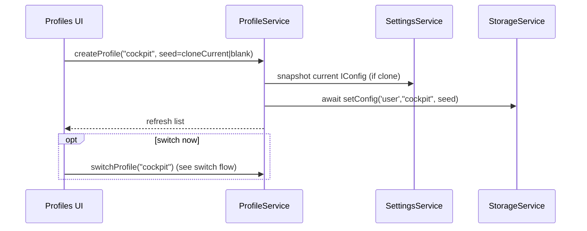

# Profile support (named configs) for KIP

> Design + implementation plan. Lives on the `named_configs` branch. Conventions aim at
> upstreamability (`mxtommy/kip`); they are not a hard constraint and may change if they
> prove counter‑productive.

## Overview

Let a user keep several independent **profiles** — each owning its own dashboards, layouts,
and theme — and switch between them at runtime, **without creating a separate Signal K user
per screen set** (today's workaround). A profile maps onto KIP's existing *named config slot*
in the Signal K `applicationData` store. The active profile is remembered **per device**, so a
cabin display, a mast display, and a cockpit display can each show a different profile from the
same single Signal K login.

The exploration that grounds this plan found the storage substrate is ~80% present: `getConfig`
/ `setConfig` / `listConfigs` / `removeItem` are already parameterized by config name, and the
active slot name (`sharedConfigName`) *already* drives both config load
(`app-initNetwork.service.ts`) and every incremental save (`storage.service.ts` `patchConfig`).
The missing pieces are (1) making that slot name runtime‑mutable instead of boot‑frozen and
(2) a management UI. No `IConfig` schema change and no migration are required.

## Problem Frame

KIP stores one active configuration. When logged in (`useSharedConfig = true`) it persists to
`…/applicationData/user/kip/{fileVersion}/{configName}`. Per‑user isolation is a property of
Signal K's `user` scope keyed by the bearer JWT — *not* of KIP. The config name is effectively
pinned to `default`. So the only lever for "a different set of screens" is a different Signal K
login. That is bad UX and the motivation for this feature.

Today the named‑slot dimension exists but is frozen: `sharedConfigName` is read once at boot
(`settings.service.ts` `loadConnectionConfig`, `app-initNetwork.service.ts`) and never changed
at runtime. The existing "Configurations" tab can already *list* named slots, but its "Restore"
action copies a chosen slot back into the fixed `user/default` slot and hard‑reloads — it is a
backup/restore flow, not a profile selector.

## Requirements Trace

- **R1.** A user can see all their profiles and which one is active (logged in, remote storage).
- **R2.** A user can switch the active profile; the switch is remembered for *this device only*.
- **R3.** A user can create a profile, seeded either from the current profile (clone) or blank.
- **R4.** A user can rename, duplicate, and delete profiles, with guard rails that prevent
  leaving the device in an unbootable state.
- **R5.** Each profile owns its own dashboards, layouts, **and theme** (per‑display theming is
  an explicit goal: cabin vs. mast vs. cockpit).
- **R6.** Existing single‑config users migrate transparently: their current `user/default`
  *is* profile #1; nothing is rewritten.
- **R7.** A profile can be exported to / imported from a JSON file.

## Scope Boundaries (non‑goals for v1)

- **No local‑only (logged‑out) profiles.** `useSharedConfig = false` stays single‑profile.
- **No hot‑swap.** Switching uses a full page reload (reuses the proven reload path). No
  in‑place dashboard/widget rebuild.
- **No enforced shared units across profiles.** Because a profile is a whole `IConfig` slot,
  `unitDefaults` is per‑profile. Clone‑on‑create carries units forward so this rarely bites.
  Globally‑shared units is explicitly deferred.
- **No profile metadata registry** (icons, ordering, descriptions). Profiles are identified by
  their slot name only — "align with named configs." A registry (Design C from exploration) is
  deferred.
- **No quick‑switch in the main app chrome.** Management and switching live in Options only.
- **No `IConfig` schema/version bump and no `ConfigurationUpgradeService` change.**

## Context & Research

### Relevant code and patterns

- `src/app/core/interfaces/app-settings.interfaces.ts` — `IConfig {app, theme, dashboards}`,
  `IConnectionConfig` (carries `useSharedConfig`, `sharedConfigName`). Schema unchanged.
- `src/app/core/services/storage.service.ts` — named‑slot CRUD already exists:
  `listConfigs` (enumerates arbitrary names per scope via `?keys=true`), `getConfig(scope,name)`,
  `setConfig(scope,name,config)` ("if name exists, replaced; else created" — this *is*
  create), `removeItem(scope,name)` (delete), and `patchConfig` whose JSON‑Patch paths are all
  `/{sharedConfigName}/…`. Note: `setConfig` returns an awaitable Promise; `removeItem`/
  `patchConfig` post to a fire‑and‑forget sequential `patchQueue$` and return `void`.
  `patchConfig` uses JSON‑Patch `replace`, which requires the slot to pre‑exist.
- `src/app/core/services/settings.service.ts` — owns the private `sharedConfigName` (loaded from
  `connectionConfig`, persisted via `buildConnectionStorageObject`). `reloadApp()` is
  `location.replace("./")` and is already a **no‑op under `__KIP_TEST__`**. `setConnectionConfig`
  notably does *not* touch `sharedConfigName` today — there is no runtime setter. Per‑attribute
  setters (`setThemeName`, `saveDashboards`, …) route to `patchConfig` when shared.
- `src/app/core/services/app-initNetwork.service.ts` — sole boot slot‑selection point: loads
  `getConfig('user', connectionConfig.sharedConfigName, …)` then `bootstrapRemoteContext`.
  Already handles a missing slot (HTTP 404 → `bootstrapIssue 'missing-shared-config'`).
- `src/app/core/components/options/configuration/config.component.ts` + `.html` — the
  "Configurations" tab to evolve. Today it **hides `user/default`** from its list and **blocks
  overwriting it**; "Restore" copies a slot into `user/default` then reloads. Save scope is
  chosen by token type (device token → `global`, user token → `user`). Already has
  download/upload (export/import) of a whole `IConfig`.
- `src/app/core/components/dashboards-editor/dashboards-editor.component.ts` — the canonical
  CRUD UI pattern to mirror: add via naming dialog, press → bottom sheet with
  delete/duplicate, edit via dialog.
- `src/app/core/services/dialog.service.ts` — `openNameDialog(DialogNameData)` for create/rename
  naming; `openConfirmationDialog` for destructive confirms.
- `src/app/app.component.ts` (`sharedConfigName || 'default'`) — the missing‑shared‑config
  degraded UX, relevant if an active profile slot disappears server‑side.
- `src/app/core/services/remote-dashboards.service.ts` — broadcasts the active dashboard set to
  remote displays; after a profile switch (post‑reload) it re‑broadcasts the new set. Per‑device
  behavior, treated as expected.

### Conventions to honor (`.github/instructions/`)

- New **app‑internal** types go in `src/app/core/interfaces` (not `contracts`, which is for
  cross‑package boundaries). A profile is app‑internal.
- Service‑centric architecture; signal‑based transient state; tests required for behavior
  changes. Test stack is **Vitest** (`@angular/build:unit-test` + `vitest.config.ts`, jsdom,
  `TestBed` + `describe/it/expect`, co‑located `*.spec.ts`).
- Theme/colors via KIP theme roles / CSS variables; no hardcoded hex in TS/SCSS.

## Key Technical Decisions

- **Profile == named `user`‑scope config slot, holding a full `IConfig`.** Reuses existing
  storage; per‑profile theme falls out for free. (Per‑profile units accepted; see scope.)
- **Active profile is per‑device**, stored in the always‑local `connectionConfig.sharedConfigName`.
  This field already exists, is already local, and already drives boot load + saves — we make it
  runtime‑mutable.
- **Switch = persist the new name to `connectionConfig` then `reloadApp()`.** After reload the
  normal bootstrap loads the chosen slot and re‑syncs both `sharedConfigName` fields
  (settings + storage). Reuses the existing reload‑restore mechanism end‑to‑end.
- **Create = `setConfig('user', name, seed)` first (creates the slot), then optionally switch.**
  Order matters because `patchConfig` `replace` needs the slot to pre‑exist and the bootstrap
  404s on a missing slot. `seed` = a clone of the current active `IConfig` or a blank default.
- **`default` is a protected, always‑present profile.** It is the guaranteed fallback a fresh
  device boots into (`DefaultConnectionConfig.sharedConfigName = 'default'`). v1 forbids
  deleting it, forbids creating another profile named `default`, and does not rename it.
- **Logic lives in a new `ProfileService`**, not fattened into the component, mirroring the
  service‑per‑concern pattern (`DashboardService` owns dashboard CRUD; `ProfileService` owns
  profile CRUD + switching). It orchestrates `StorageService` (slot CRUD) and `SettingsService`
  (active name + reload + current‑config snapshot).
- **User‑facing term: "Profiles."** Internally/storage they remain named configs. (Recommended;
  a maintainer could keep "Configurations." Low‑cost to change — it is copy.)

## Open Questions

### Resolved during planning

- *What is a profile?* A `user`‑scope named `IConfig` slot. (Locked.)
- *Where is "active" stored?* `connectionConfig.sharedConfigName`, per device. (Locked.)
- *How does switching re‑render?* Full reload. (Locked.)
- *Migration?* None — existing `user/default` is profile #1. (Locked.)
- *Local mode?* Out of scope for v1. (Locked.)
- *Logic location?* New `ProfileService`. (Decided; could fold into `SettingsService` if
  maintainers prefer.)
- *Is `default` special?* Yes — protected fallback. (Decided.)

### Deferred to implementation

- Exact `ProfileService`/`SettingsService` method names and signatures.
- Profile‑name validation/sanitization specifics (names are URL path segments and must avoid
  `/` and the `::` separator used by `config.component`'s list keys). Decision: display name ==
  slot name, restricted to a safe charset.
- Whether to add an awaitable delete (or a `storage.sharedConfigName` setter) so a **rename of
  the active profile** can avoid the `removeItem`‑before‑`reload` race. Recommended fallback:
  create new slot (awaited) → switch (reload) → delete old slot; a not‑yet‑flushed delete leaves
  a harmless orphan the user can remove. Final mechanism chosen against real code.
- Exact "missing active slot on boot" recovery wording/affordance reuse from `app.component`.

## High‑Level Technical Design

> *Directional guidance for review, not implementation specification. The implementing agent
> should treat these as context, not code to reproduce.*

**Model mapping**

```
Signal K applicationData (per Signal K user, gated by JWT)
  user/kip/{fileVersion}/
    ├── default     ← profile #1 (protected fallback)   ┐
    ├── cabin       ← profile                            ├─ each value is a full IConfig
    └── cockpit     ← profile                            ┘     {app, theme, dashboards}

Per device (localStorage connectionConfig.sharedConfigName) → which profile this device shows
```

**Switch flow (reload‑based)**

```mermaid
sequenceDiagram
  participant UI as Profiles UI
  participant PS as ProfileService
  participant SET as SettingsService
  participant LS as localStorage(connectionConfig)
  participant BOOT as app-initNetwork (next load)
  participant ST as StorageService

  UI->>PS: switchProfile("cockpit")
  PS->>SET: setActiveProfile("cockpit")
  SET->>LS: persist sharedConfigName="cockpit"
  SET->>SET: reloadApp()  (location.replace; no-op under __KIP_TEST__)
  Note over BOOT,ST: on reload
  BOOT->>ST: getConfig('user',"cockpit")
  BOOT->>ST: bootstrapRemoteContext(sharedConfigName="cockpit")
  Note over ST: subsequent patchConfig writes target /cockpit/...
```

**Create flow (slot must exist before it can become active)**



## Implementation Units

- [ ] **Unit 1: Spike — verify arbitrary named‑slot CRUD against a live Signal K server**

**Goal:** De‑risk the one external assumption before building on it: that the Signal K
`applicationData` `user` scope accepts read/write/list/delete for **arbitrary** names (not just
`default`), and learn any name charset constraints.

**Requirements:** R1–R4 (foundational).

**Dependencies:** None.

**Files:** none persistent (throwaway script / manual `curl` / temporary spec). Record findings
in this doc under "Open Questions → Resolved" before proceeding.

**Approach:**
- Against a real server (e.g. the Signal K demo server, or `halosdev.local`), exercise
  `setConfig`/`getConfig`/`listConfigs`/`removeItem` (or equivalent REST) with a couple of
  arbitrary names. Confirm create, list, fetch, delete, and that `listConfigs` returns the new
  names. Probe charset edge cases (spaces, unicode, `/`, very long).
- Confirm `patchConfig`‑style `replace` fails on a non‑existent slot (validates the create‑first
  ordering decision).

**Test expectation:** none (spike). Output is a go/no‑go + a charset rule that feeds Unit 3's
name validation.

**Verification:** Documented confirmation that arbitrary user‑scope names round‑trip, plus the
allowed‑name rule. If the server restricts names unexpectedly, revisit before Unit 2.

---

- [ ] **Unit 2: `SettingsService` — runtime‑mutable active profile**

**Goal:** Turn the boot‑frozen slot name into a runtime‑settable one and expose a clean snapshot
of the current config, so `ProfileService` can orchestrate without reaching into privates.

**Requirements:** R2, R3, R6.

**Dependencies:** Unit 1.

**Files:**
- Modify: `src/app/core/services/settings.service.ts`
- Test: `src/app/core/services/settings.service.spec.ts`

**Approach:**
- Add a read accessor for the active profile name (current `sharedConfigName`).
- Add a setter that sets the private name, persists `connectionConfig` to localStorage
  (existing `buildConnectionStorageObject` already includes `sharedConfigName`), and triggers
  `reloadApp()`. This is the switch primitive.
- Add a current‑config snapshot accessor that assembles an `IConfig` from existing getters
  (`getAppConfig`, `getDashboardConfig`, `getThemeConfig`) for clone‑on‑create. (The component
  already builds this shape in `getLocalConfigFromMemory`; centralize it here.)
- Keep the two `sharedConfigName` fields (settings + storage) in mind: the reload‑based switch
  re‑syncs both via bootstrap, so no in‑memory storage mutation is needed in v1.

**Patterns to follow:** existing setter→persist pattern in `settings.service.ts`;
`reloadApp()`'s `__KIP_TEST__` guard makes side effects assertable.

**Test scenarios:**
- Happy path: setting the active profile persists the new name into the `connectionConfig`
  localStorage object and invokes the reload primitive (assert the persisted value; reload is a
  no‑op under test).
- Happy path: the active‑profile getter returns the boot‑loaded name (`default` by default).
- Happy path: the snapshot accessor returns an `IConfig` whose `app`/`theme`/`dashboards` match
  current settings state.
- Edge: setting the active profile to the already‑active name still persists/reloads (idempotent
  from the caller's view) — or is short‑circuited; assert the chosen behavior explicitly.

**Verification:** Active profile name can be read and changed at runtime; the change is durable
in `connectionConfig` and would re‑point load + saves on next boot.

---

- [ ] **Unit 3: `ProfileService` — profile CRUD + switch orchestration**

**Goal:** One service owning list / switch / create / rename / duplicate / delete, with guard
rails, name validation, and clone seeding.

**Requirements:** R1, R2, R3, R4, R5, R6.

**Dependencies:** Unit 2.

**Files:**
- Create: `src/app/core/services/profile.service.ts`
- Create: `src/app/core/services/profile.service.spec.ts`
- Modify (if a Profile/summary type is warranted): `src/app/core/interfaces/app-settings.interfaces.ts`
  (reuse `StorageService.Config {name, scope}` if a new type adds nothing).

**Approach:**
- **List:** `listConfigs()` filtered to `user` scope; **include `default`** (unlike today's UI).
  Mark the active one (compare to `SettingsService` active name). Expose as a signal for the UI.
- **Switch:** delegate to `SettingsService.setActiveProfile(name)` (persist + reload).
- **Create:** validate name (charset from Unit 1; reject empty, reject `default`, reject existing
  names); seed = clone of current snapshot or blank default `IConfig`; `await setConfig('user',
  name, seed)`; refresh list. Do **not** auto‑switch unless the UI asks.
- **Duplicate:** `getConfig('user', source)` → `setConfig('user', newName, copy)`.
- **Rename:** create new slot from old's content, then delete old. If renaming the **active**
  profile, switch to the new name (reload) — and accept that the old slot's delete may be an
  orphan if it doesn't flush pre‑reload (see deferred question). If renaming a **non‑active**
  profile, no reload is needed and the delete flushes normally.
- **Delete:** guard rails — refuse to delete the active profile, `default`, or the last
  remaining profile; otherwise `removeItem('user', name)` + refresh.
- Surface all `StorageService` errors via the existing toast pattern; never change the active
  name on a failed mutation.

**Patterns to follow:** `DashboardService` CRUD shape; `config.component.ts`'s existing
`getServerConfigList`/`saveConfig`/`deleteConfig` calls (the underlying storage calls move here).

**Test scenarios:**
- Happy path: list returns user‑scope slots including `default`, with the active one flagged.
- Happy path: create (blank) issues `setConfig` with a blank `IConfig` under the new name and
  refreshes the list.
- Happy path: create (clone) seeds the new slot with the current snapshot (dashboards + theme
  carried over).
- Happy path: duplicate copies source content into a new name.
- Happy path: switch delegates to the settings setter.
- Edge/Error: create with empty name, `default`, an existing name, or an invalid charset → rejected,
  no `setConfig`, error surfaced.
- Edge/Error: delete the active profile / `default` / the last profile → blocked with a clear
  reason; no `removeItem`.
- Error: `setConfig`/`getConfig` rejects → error surfaced, list and active name unchanged.
- Integration: create‑then‑switch ordering — `setConfig` resolves before the switch is offered
  (guards the create‑first invariant).

**Verification:** All CRUD operations behave with guard rails enforced; clone seeding verified;
no operation can leave the device pointing at a non‑existent slot.

---

- [ ] **Unit 4: Profiles UI in the Configurations tab**

**Goal:** Replace the backup/restore framing with a Profiles experience: see profiles, see the
active one, switch, create (clone/blank), rename, duplicate, delete, and export/import.

**Requirements:** R1, R2, R3, R4, R5, R7.

**Dependencies:** Unit 3.

**Files:**
- Modify: `src/app/core/components/options/configuration/config.component.ts`
- Modify: `src/app/core/components/options/configuration/config.component.html`
- Modify: `src/app/core/components/options/configuration/config.component.scss` (as needed)
- Test: `src/app/core/components/options/configuration/config.component.spec.ts`
  (create if absent)

**Approach:**
- Render a profile list (from `ProfileService`) with the active profile clearly marked and a
  switch affordance per non‑active profile. Mirror the `dashboards-editor` interaction shape:
  primary action to switch; per‑item actions (rename/duplicate/delete) via menu or bottom sheet;
  "New profile" via `DialogService.openNameDialog`, with a clone‑vs‑blank choice; destructive
  actions confirmed via `openConfirmationDialog`.
- **Remove the special‑casing of `user/default`**: it now appears as a normal (protected)
  profile. Drop the "hide default" filter and the "block saving default" guard, since profile
  creation/switch no longer routes through the old backup form. Keep `default` non‑deletable in
  the UI (driven by `ProfileService` guards).
- Re‑label/keep Download/Upload as **Export profile / Import profile**. Import currently writes
  into `user/default` then reloads; v1 may keep importing into the active profile (document the
  exact target) — do not silently overwrite a non‑active profile.
- Keep the no‑token / `useSharedConfig=false` states: when not logged in, show a clear
  "Profiles require Signal K login" message (remote‑only scope).
- Theme via CSS variables; no hardcoded colors.

**Patterns to follow:** `dashboards-editor.component.ts` (+ bottom sheet), `dialog.service.ts`
naming/confirmation dialogs, existing `config.component` form/list styling.

**Test scenarios:**
- Happy path: the list renders profiles with the active one marked.
- Happy path: choosing a non‑active profile calls `ProfileService.switchProfile`.
- Happy path: "New profile" opens the name dialog and calls create with the chosen seed mode.
- Happy path: rename / duplicate / delete call the corresponding service methods with confirmation.
- Edge: delete affordance is absent/disabled for `default`, the active profile, and the last
  profile.
- Edge: logged‑out / local‑mode shows the remote‑only notice and no profile actions.
- Error: a failing service call surfaces a toast and leaves the list intact.

**Verification:** A logged‑in user can complete the full profile lifecycle from Options; the
active profile is obvious; protected/guarded actions are not offered.

---

- [ ] **Unit 5: Bootstrap & degraded‑path resilience**

**Goal:** Confirm the per‑device active profile loads at boot and that a missing active slot
(e.g., deleted on another device) degrades gracefully rather than wedging.

**Requirements:** R2, R6.

**Dependencies:** Unit 2 (and behavioral overlap with Units 3–4).

**Files:**
- Verify/adjust: `src/app/core/services/app-initNetwork.service.ts`
- Verify/adjust: `src/app/app.component.ts` (missing‑shared‑config affordance)
- Test: `src/app/core/services/app-initNetwork.service.spec.ts` (extend),
  `src/app/app.component.spec.ts` (if affordance changes)

**Approach:**
- Confirm boot already loads `connectionConfig.sharedConfigName` (it does) — no change expected
  beyond tests asserting a non‑`default` name is honored.
- Ensure the existing `missing-shared-config` (404) path is reachable and sensible when a
  device's remembered profile no longer exists server‑side; reuse the existing recovery
  affordance (offer to fall back to / recreate `default`). Avoid a hard wedge.

**Test scenarios:**
- Happy path: boot with `sharedConfigName = "cockpit"` loads that slot and bootstraps storage
  with that name.
- Edge/Error: boot when the remembered slot 404s emits `missing-shared-config` and the app
  reaches a recoverable state (does not crash).

**Verification:** A device that switched to a now‑deleted profile recovers to a usable state;
a normal device boots straight into its remembered profile.

---

- [ ] **Unit 6: Documentation & changelog**

**Goal:** Explain profiles to users and record the change; keep terminology consistent.

**Requirements:** R1–R7 (discoverability).

**Dependencies:** Units 2–5.

**Files:**
- Modify: the Login & Configuration help doc under `src/assets/help-docs/` (the
  `/help/configuration` content referenced by `config.component.html`).
- Modify: `CHANGELOG.md`.
- Modify (if maintainers want it tracked): this design doc's status.

**Approach:** Document what a profile is, per‑device active selection, clone‑on‑create, the
`default` fallback, per‑profile theme, and the remote‑only v1 limitation. Use consistent
"Profiles" terminology.

**Test expectation:** none — docs only.

**Verification:** Help content matches shipped behavior; CHANGELOG entry present.

## System‑Wide Impact

- **Interaction graph:** a switch is a full reload → re‑runs `app-initNetwork` → `StorageService`
  bootstrap → `SettingsService.startup` → `pushSettings` → dashboards signal → widgets, and
  `RemoteDashboardsService` re‑broadcasts the new profile's dashboard set. All existing wiring;
  nothing new in the data path.
- **Error propagation:** storage operations throw `HttpErrorResponse`; `ProfileService` surfaces
  them via the existing toast service and leaves active state unchanged on failure.
- **State lifecycle risks:** `removeItem`/`patchConfig` are fire‑and‑forget via `patchQueue$`;
  the only sensitive ordering is delete‑before‑reload (rename of active profile). Mitigated by
  awaiting `setConfig` before any reload and by guard rails that forbid deleting the active
  profile; a non‑flushed delete is a harmless orphan slot.
- **API surface parity:** two `sharedConfigName` fields (`SettingsService` private + public
  `StorageService.sharedConfigName`). The reload‑based switch re‑syncs both via bootstrap; v1
  avoids any non‑reload path that would need them updated independently.
- **Integration coverage:** the reload itself can't be unit‑tested (no‑op under `__KIP_TEST__`);
  assert the pre‑reload side effects (persisted name, storage calls) in unit tests and verify the
  end‑to‑end load‑under‑new‑name path manually / via e2e.
- **Unchanged invariants:** `IConfig` schema; `configFileVersion` (11) and `configVersion`
  semantics; `ConfigurationUpgradeService`; local‑mode single‑config behavior; the Signal K
  `applicationData` endpoint contract; widget/dataset/history pipelines.

## Risks & Dependencies

| Risk | Mitigation |
|------|------------|
| Signal K server rejects arbitrary user‑scope config names | Unit 1 spike gates the work; charset rule feeds name validation. |
| `removeItem` not flushed before reload (rename of active) | Await `setConfig` before reload; guard‑forbid deleting active; orphan slot is harmless and user‑deletable. |
| Deleting `default` breaks a fresh device's boot | `default` is protected (no delete, no name reuse). |
| Two `sharedConfigName` fields drift | Reload re‑bootstraps both; v1 avoids non‑reload switching. |
| Name charset / URL‑safety (path segment; `::` list‑key separator) | Validate/sanitize; display name == slot name. |
| Users expect shared units, get per‑profile units | Clone‑on‑create carries units forward; documented; shared‑units deferred. |
| Reframing the existing backup/restore/"default hidden" semantics confuses returning users | Clear UI copy + help‑doc update (Unit 6); migration is transparent (default = profile #1). |

## Sources & References

- Grounding exploration: read‑only architecture sweep of `storage.service.ts`,
  `settings.service.ts`, `app-initNetwork.service.ts`,
  `components/options/configuration/config.component.*`, `dashboards-editor.component.ts`,
  `dialog.service.ts`, `app-settings.interfaces.ts`, plus a repo‑wide sweep of `'default'` /
  `sharedConfigName` usages and the Vitest test setup.
- Conventions: `.github/instructions/project.instructions.md`,
  `.github/instructions/best-practices.instructions.md`, `COPILOT.md`.
- Upstream: `mxtommy/kip` (this is the `mairas/Kip` fork, `named_configs` branch).
